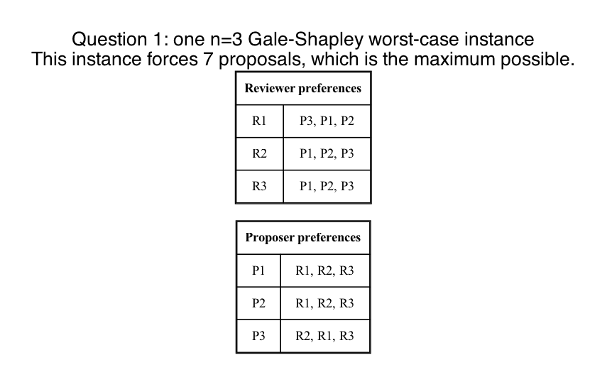
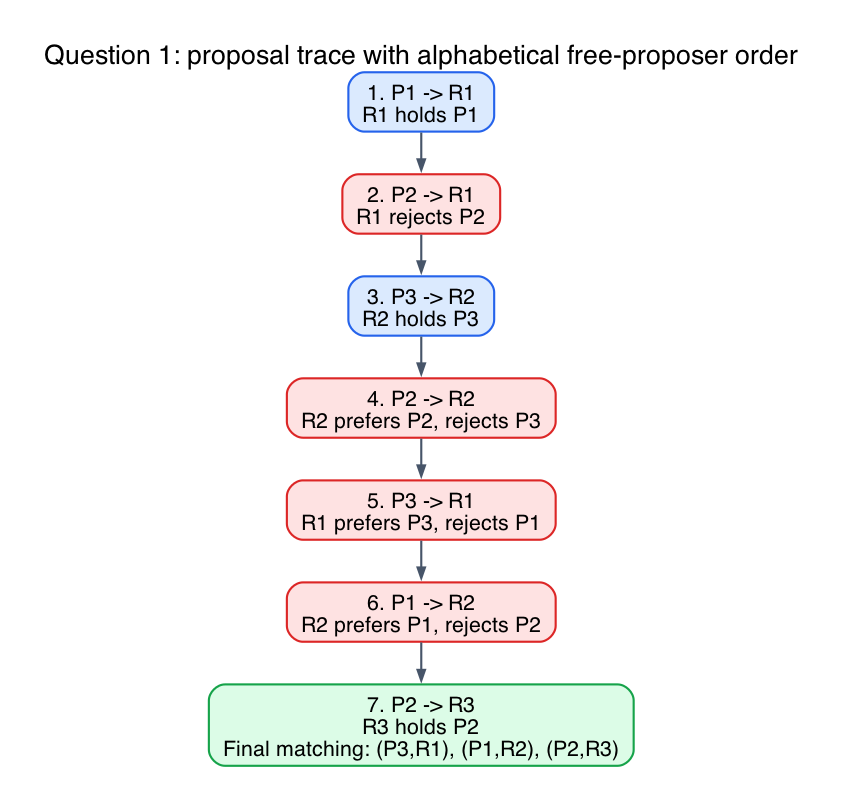

# Question 1: Adversarial Reverse-Engineering

## Question

**The Scenario:** You are designing a stable matching instance for `n=3` proposers (`P1, P2, P3`) and `n=3` reviewers (`R1, R2, R3`).

**Your Task:** Construct the exact preference lists for all 6 participants to force the Gale-Shapley algorithm (with `P` proposing) to execute the absolute maximum possible number of rejections before terminating in a stable matching.

- You must write out the complete preference matrices for both sides.
- State the exact number of proposals that will be made in your worst-case execution.
- Mechanically explain why this specific preference structure forces the proposers to "slide down" their lists as slowly as mathematically possible without terminating early.

## One worst-case instance

Use these preferences:

Proposers:

- `P1: R1, R2, R3`
- `P2: R1, R2, R3`
- `P3: R2, R1, R3`

Reviewers:

- `R1: P3, P1, P2`
- `R2: P1, P2, P3`
- `R3: P1, P2, P3`

Visual table:

## Exact number of proposals

The algorithm makes exactly:

`7 proposals`

This is the maximum possible for `n=3`.

In general, the proposer-side Gale-Shapley algorithm can be forced to make as many as

`n^2 - n + 1`

proposals, and for `n=3` that equals

`3^2 - 3 + 1 = 7`.

## Mechanical trace

Assume free proposers are processed in alphabetical order.

Then the proposal sequence is:

1. `P1 -> R1`, and `R1` holds `P1`
2. `P2 -> R1`, and `R1` rejects `P2`
3. `P3 -> R2`, and `R2` holds `P3`
4. `P2 -> R2`, and `R2` prefers `P2`, so `P3` is rejected
5. `P3 -> R1`, and `R1` prefers `P3`, so `P1` is rejected
6. `P1 -> R2`, and `R2` prefers `P1`, so `P2` is rejected
7. `P2 -> R3`, and `R3` accepts

This leaves the final stable matching:

- `(P3, R1)`
- `(P1, R2)`
- `(P2, R3)`

Proposal trace:

## Why this is slow in exactly the right way

The structure is designed so that rejections happen as a long chain instead of ending quickly.

- `P1` and `P2` both start by competing for `R1`.
- `P3` starts at `R2`, so the algorithm does not terminate too quickly with three easy first-choice matches.
- `R2` is arranged to prefer `P1` over `P2` over `P3`, so `P2` can temporarily displace `P3`, but then later `P1` can displace `P2`.
- `R1` is arranged to prefer `P3` over `P1` over `P2`, so after `P3` gets thrown out of `R2`, he can come back and displace `P1`.

This creates the longest possible rejection cascade for `n=3`:

- one proposer is rejected immediately
- another proposer is rejected later by a chain reaction
- the first rejected proposer gets rejected again before finally falling to the last reviewer

So the proposers slide down their lists one step at a time, with each step triggered by a better proposer arriving later.

## Final answer

- Preference lists:
  - `P1: R1, R2, R3`
  - `P2: R1, R2, R3`
  - `P3: R2, R1, R3`
  - `R1: P3, P1, P2`
  - `R2: P1, P2, P3`
  - `R3: P1, P2, P3`
- Exact number of proposals: `7`
- Final matching: `(P3,R1), (P1,R2), (P2,R3)`

## Fundamentals

- **Each proposer moves downward only after rejection.**
  So to maximize proposals, you want as many delayed rejections as possible.

- **Reviewers keep their current favorite so far.**
  This is what makes later arrivals trigger chain reactions.

- **Worst-case Gale-Shapley is about cascading displacement.**
  The slowest instances are the ones where proposals keep bumping previously held matches instead of ending quickly with first choices.
