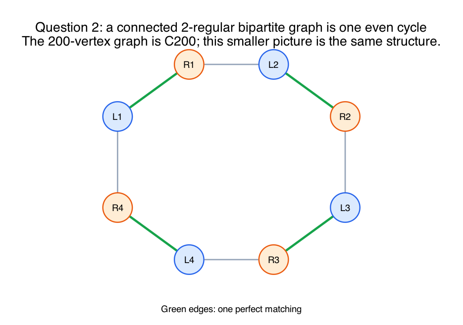
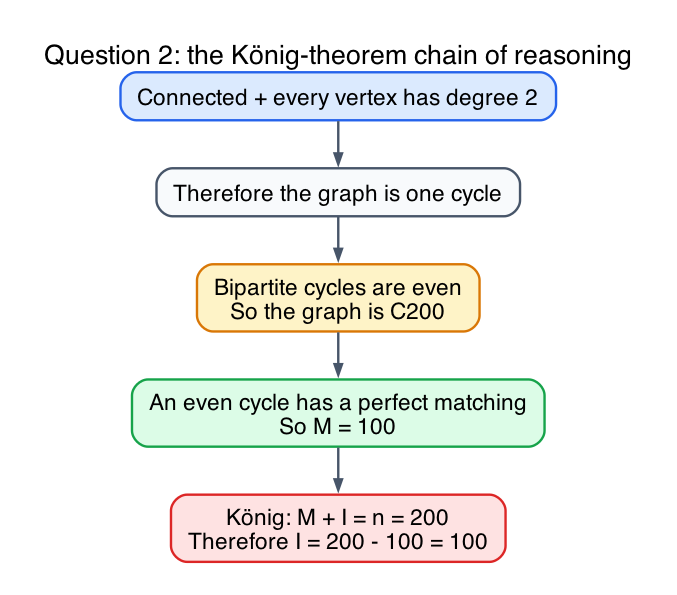

# Question 2: Implicit Structural Bounds

## Question

**The Scenario:** Let `G` be a connected bipartite graph with partitions `L` and `R`, where `|L| = 100` and `|R| = 100`. You are told that `G` is exactly 2-regular, meaning every vertex in `L` has degree 2 and every vertex in `R` has degree 2.

**Your Task:** What is the absolute mathematical maximum, and the absolute mathematical minimum size of a Maximum Independent Set in `G`?

- You must derive this bound strictly using König's Theorem (`M + I = n`).
- Prove your bounds by demonstrating what the Maximum Bipartite Matching (`M`) must be for any 2-regular bipartite graph.

## Structural observation

A connected graph in which every vertex has degree exactly `2` must be a single cycle.

Because the graph is bipartite, that cycle must be even.

The graph has `100 + 100 = 200` vertices total, so it must be:

`C200`

Representative picture:

## Maximum matching size

An even cycle has a perfect matching: take every other edge around the cycle.

So in this graph:

`M = 100`

because all `200` vertices can be matched in pairs.

## Apply König's theorem

König's theorem for bipartite graphs says:

`M + I = n`

Here:

- `n = 200`
- `M = 100`

Therefore:

`I = 200 - 100 = 100`

Reasoning chain:

## Maximum and minimum possible values of I

Because every connected 2-regular bipartite graph on these vertex counts is forced to be the same structure, `C200`, the value of `I` is forced.

So:

- absolute maximum possible size of a maximum independent set: `100`
- absolute minimum possible size of a maximum independent set: `100`

There is no variation.

## Why the independent set has size 100 directly

You can also see this from the bipartition itself:

- every vertex in `L` is independent
- every vertex in `R` is independent

Each side has size `100`, so an independent set of size `100` definitely exists.

König's theorem shows it cannot be any larger.

## Final answer

- `M = 100`
- `I = 100`
- maximum possible value of `I`: `100`
- minimum possible value of `I`: `100`

## Fundamentals

- **Connected 2-regular means cycle.**
  Degree `2` everywhere forces each component to be a cycle; connectedness leaves only one cycle.

- **Bipartite cycle means even cycle.**
  Odd cycles are impossible in bipartite graphs.

- **Perfect matching on even cycles.**
  Every other edge gives a perfect matching.

- **König's identity pins I exactly.**
  Once `M` is known, `I` is forced by `M + I = n`.
