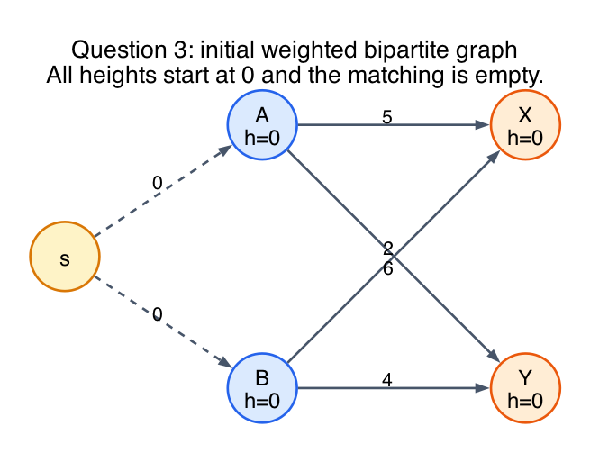
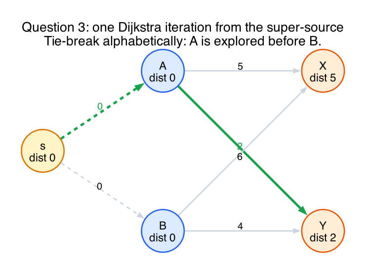
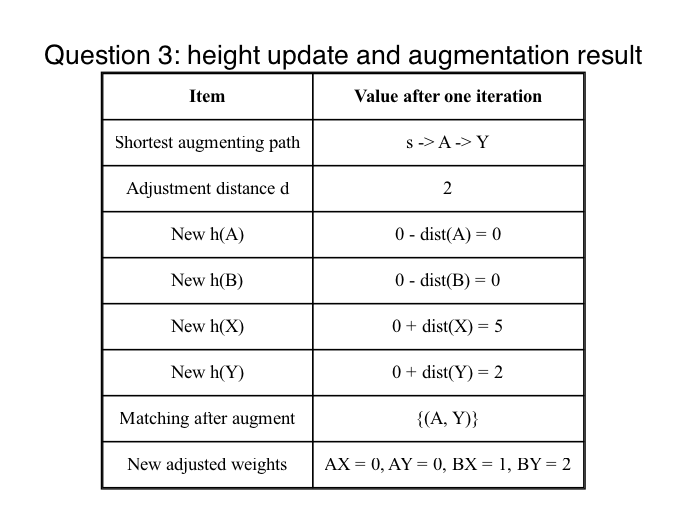

# Question 3: Mechanical Tracing via Data Structures

## Question

**The Scenario:** You are solving the Minimum-Weight Perfect Matching (Assignment) Problem. You are given a complete bipartite graph with `L={A, B}` and `R={X, Y}`. The original edge weights are:

`costs = {('A','X'): 5, ('A','Y'): 2, ('B','X'): 6, ('B','Y'): 4}`

Currently, the matching is empty. The initial vertex heights are:

- `h(A)=0`
- `h(B)=0`
- `h(X)=0`
- `h(Y)=0`

You must trace exactly one iteration of the Dijkstra-based shortest-alternating-path algorithm starting from the artificial super-source `s`.

Tasks:

1. Trace the shortest path from `s` to an unmatched vertex in `R` using adjusted weights `w_adj = w_orig - h(u) - h(v)`, tie-breaking alphabetically.
2. State the adjustment distance `d`.
3. Give the new heights after the height adjustment step.
4. List the matching after augmenting.

## Initial adjusted weights

Because all heights start at `0`, the adjusted weights are just the original costs:

- `AX = 5`
- `AY = 2`
- `BX = 6`
- `BY = 4`

The initial graph is:

## Dijkstra trace

The matching is empty, so the super-source `s` has zero-cost edges to both unmatched red vertices `A` and `B`.

So the initial distances are:

- `dist(s)=0`
- `dist(A)=0`
- `dist(B)=0`

By the alphabetical tie-break, Dijkstra explores `A` before `B`.

From `A`:

- `dist(X) = 5`
- `dist(Y) = 2`

Then `B` is still at distance `0`, so it is explored before `Y`.

From `B`:

- `dist(X)` stays `5` because `min(5, 0+6) = 5`
- `dist(Y)` stays `2` because `min(2, 0+4) = 2`

So the shortest path from `s` to an unmatched blue vertex is:

`s -> A -> Y`

with total distance:

`d = 2`

Trace picture:

## Height adjustment

Lecture 9b's rule is:

- subtract the Dijkstra distance at red vertices
- add the Dijkstra distance at blue vertices

So:

- `h(A) = 0 - 0 = 0`
- `h(B) = 0 - 0 = 0`
- `h(X) = 0 + 5 = 5`
- `h(Y) = 0 + 2 = 2`

## Augmentation

Augment along the path `s -> A -> Y`.

That adds the matching edge:

`(A, Y)`

So after one iteration, the matching is:

`{(A, Y)}`

Summary table:

## Final answer

1. Shortest alternating path: `s -> A -> Y`
2. Adjustment distance: `d = 2`
3. New heights:
   - `h(A)=0`
   - `h(B)=0`
   - `h(X)=5`
   - `h(Y)=2`
4. Matching after augmenting:
   - `{(A, Y)}`

## Fundamentals

- **Adjusted weight.**
  The algorithm runs on reduced costs `w_orig - h(u) - h(v)` so Dijkstra can be used.

- **Super-source.**
  The artificial source connects to unmatched left-side vertices with cost `0`.

- **Height update.**
  In the lecture-9b version, red heights go down by their distances and blue heights go up by their distances.

- **Augmenting path.**
  Once the shortest alternating path is found, flip the matched/unmatched status along it.
