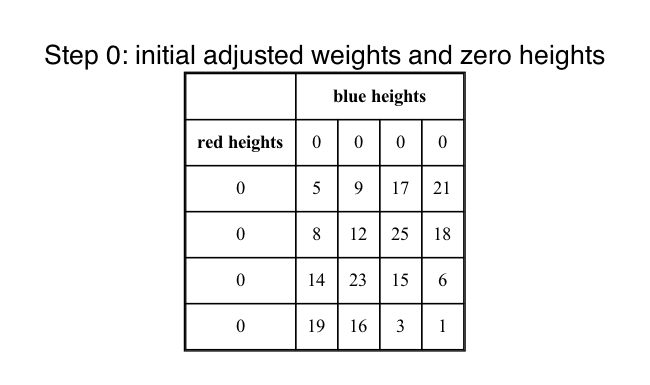
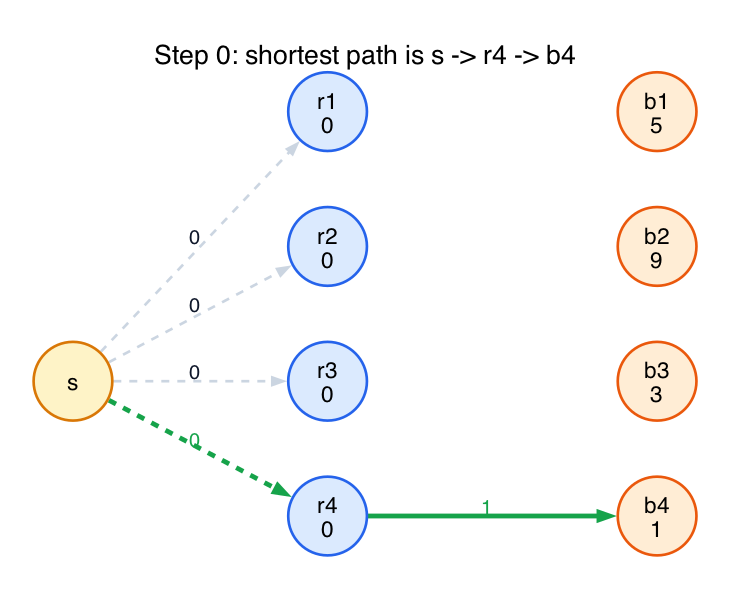
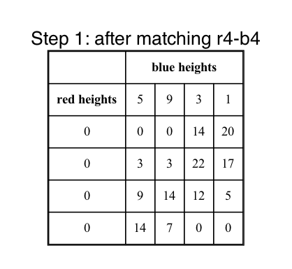
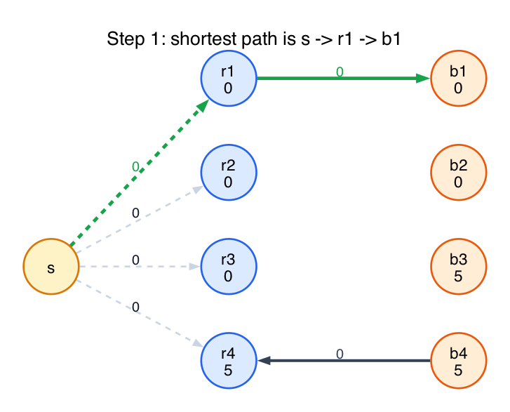
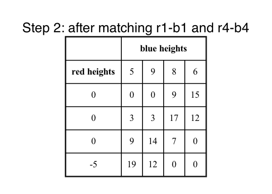
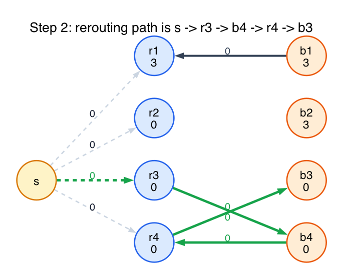
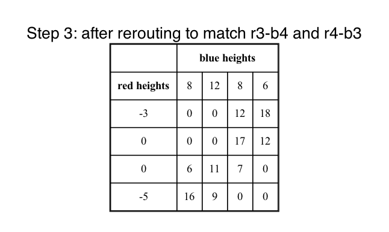
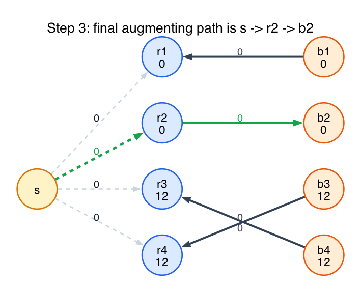
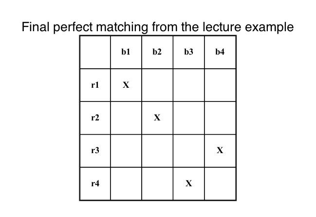
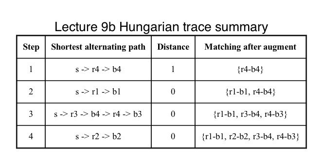

# Lecture 9b Full Trace Example

This folder recreates the full `4 x 4` weighted-matching example from Lecture 9b and shows the Hungarian algorithm all the way through to a perfect matching.

The original cost matrix is:

- row `r1`: `5, 9, 17, 21`
- row `r2`: `8, 12, 25, 18`
- row `r3`: `14, 23, 15, 6`
- row `r4`: `19, 16, 3, 1`

The pictures are split into two views at each step:

- a matrix view showing the current adjusted weights and heights
- a path view showing the shortest alternating path found at that stage

## Step 0: Start from zero heights

All heights begin at `0`, so the adjusted matrix is the same as the original cost matrix.

The shortest alternating path is:

- `s -> r4 -> b4`

Its distance is `1`, so the first matched edge is `r4-b4`.

## Step 1: One matched edge

After the first height update, the blue heights are:

- `5, 9, 3, 1`

and the red heights remain:

- `0, 0, 0, 0`

Now the shortest alternating path is:

- `s -> r1 -> b1`

Its distance is `0` in the adjusted graph, so we can add `r1-b1` immediately.

Matching after this augmentation:

- `r1-b1`
- `r4-b4`

## Step 2: The rerouting step

This is the important picture in the lecture.

The matching currently is:

- `r1-b1`
- `r4-b4`

The next shortest alternating path is:

- `s -> r3 -> b4 -> r4 -> b3`

Why does it go backward in the middle?

- `r3 -> b4` is an unmatched edge we want to use
- but `b4` is already matched to `r4`
- so in the alternating-path graph, the matched edge appears backward as `b4 -> r4`
- that lets the algorithm undo the old choice `r4-b4` and reroute it

After augmenting along this path:

- `r4-b4` is removed
- `r3-b4` is added
- `r4-b3` is added

So the matching becomes:

- `r1-b1`
- `r3-b4`
- `r4-b3`

## Step 3: Finish the perfect matching

After the reroute, the current matching is:

- `r1-b1`
- `r3-b4`
- `r4-b3`

The final shortest alternating path is:

- `s -> r2 -> b2`

This adds the last unmatched pair `r2-b2`.

## Step 4: Final answer

The final perfect matching is:

- `r1-b1`
- `r2-b2`
- `r3-b4`
- `r4-b3`

## Summary picture

This table collects the four augmenting paths in one place.

## Fundamentals

- **Adjusted weights.** The algorithm does not run directly on the original weights. It runs on reduced costs `w(u,v) - h(red) - h(blue)`.
- **Why heights matter.** The height updates keep all adjusted weights nonnegative, which is what makes Dijkstra valid.
- **Alternating path.** A path alternates between unmatched forward edges and matched backward edges.
- **Why backward edges appear.** A backward edge means “this edge is currently in the matching, so I am allowed to cancel it if that helps build a better augmenting path.”
- **What augmentation does.** It flips the status of every edge on the alternating path: unmatched edges become matched, and matched edges become unmatched.

## Why this example matters

This example shows the three pieces students usually need to see together:

- the matrix view of height-adjusted edge weights
- the path view of Dijkstra on the alternating graph
- the rerouting step where a backward matched edge is necessary to continue
