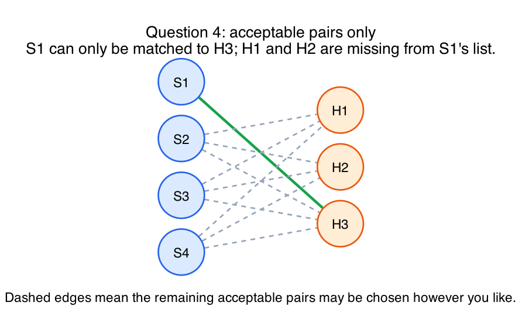
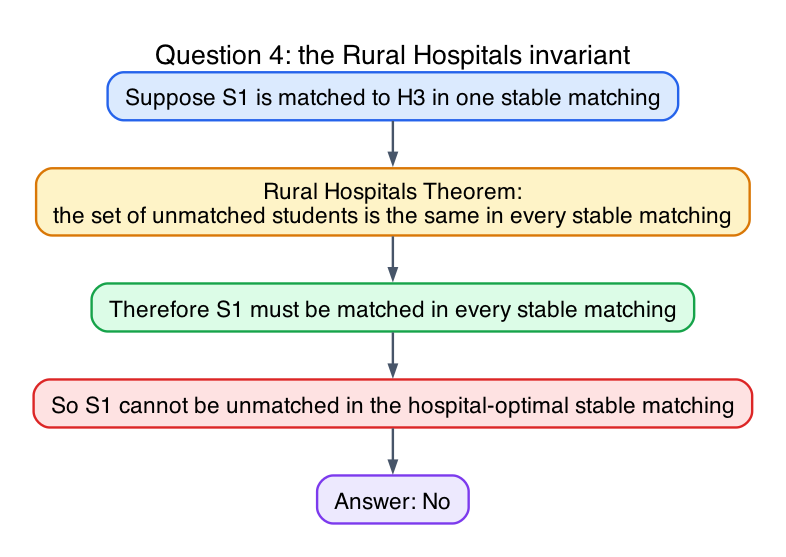

# Question 4: The Edge-Case Definition Trap

## Question

**The Scenario:** Consider a Gale-Shapley stable matching instance with unequal sets and incomplete preference lists. There are 4 students (`S1, S2, S3, S4`) and 3 hospitals (`H1, H2, H3`), each with capacity 1.

Student `S1` finds `H1` and `H2` strictly unacceptable, so those hospitals are missing from `S1`'s list and `S1` is missing from theirs.

**Your Task:** Is it possible to choose the remaining preference lists so that `S1` is matched to `H3` in the student-optimal stable matching, but unmatched in the hospital-optimal stable matching?

- Answer Yes or No.
- If Yes, give preferences.
- If No, prove it using the structural definition of unmatched vertices across all stable matchings.

## Answer

**No.**

It is not mathematically possible.

## Why the answer is no

The key theorem is the **Rural Hospitals Theorem**.

In the one-slot hospital setting with incomplete preference lists, it implies:

- the set of matched students is the same in every stable matching
- equivalently, the set of unmatched students is also the same in every stable matching

So if `S1` is matched in one stable matching, then `S1` must be matched in **every** stable matching.

In particular:

- if `S1` were matched to `H3` in the student-optimal stable matching
- then `S1` would have to remain matched in the hospital-optimal stable matching as well

Therefore the requested situation cannot happen.

Acceptability picture:

The theorem logic:

## Short proof

Assume for contradiction that:

- `S1` is matched to `H3` in the student-optimal stable matching
- `S1` is unmatched in the hospital-optimal stable matching

Then the set of unmatched students would be different in two stable matchings of the same instance.

But the Rural Hospitals Theorem says that cannot happen.

Contradiction.

So the answer is no.

## Final answer

- **No**, such preferences do not exist.

## Fundamentals

- **Incomplete preference lists create an acceptable-pairs graph.**
  Missing pairs are not merely low-ranked; they are forbidden altogether.

- **Student-optimal and hospital-optimal are both stable matchings of the same graph.**
  They may differ in who gets which acceptable partner, but not in who is matched at all.

- **Rural Hospitals is a matched-set invariant.**
  In this setting, the unmatched students are the same in every stable matching.
