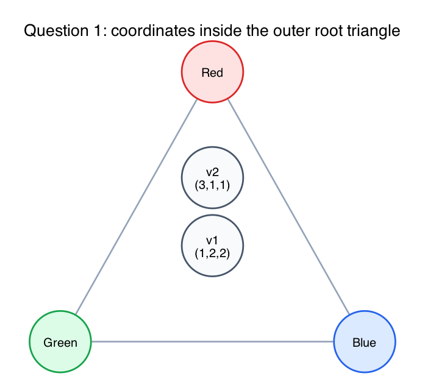
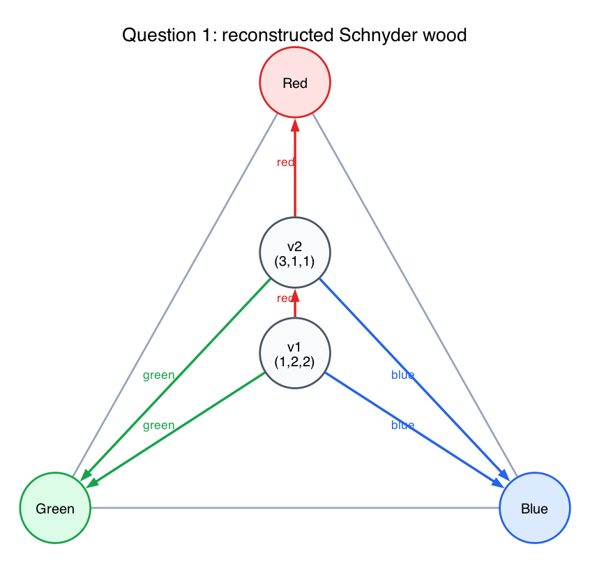
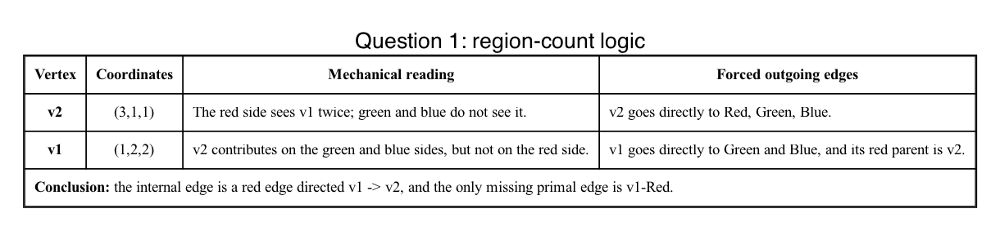

# Question 1: Adversarial Reverse-Engineering

## Question

**The Scenario:** You are given a maximal planar graph with exactly `5` vertices: three outer boundary roots (`Red`, `Green`, `Blue`) and two internal vertices (`v1`, `v2`). You are not given a drawing or an edge list. You are only given the final trilinear coordinates `(X,Y,Z)` calculated from a valid, strictly-colored Schnyder Wood:

- `v1` coordinates: `(1,2,2)`
- `v2` coordinates: `(3,1,1)`

**Your Task:** Reverse-engineer the exact internal edge connections between `{v1,v2}` and the three roots.

1. Which specific root(s) does `v1` have a direct, outgoing edge to?
2. Which specific root(s) does `v2` have a direct, outgoing edge to?
3. Is there a directed edge between `v1` and `v2`? If so, what color is it, what direction does it point, and how does the region-counting math mechanically prove the answer?

## Answer

Using the standard root order `(Red, Green, Blue)` for the coordinate triple:

1. `v1` has direct outgoing edges to `Green` and `Blue`.
2. `v2` has direct outgoing edges to `Red`, `Green`, and `Blue`.
3. Yes. The internal edge is a **red** directed edge `v1 -> v2`.

So the reconstructed undirected graph is:

- outer triangle: `Red-Green`, `Green-Blue`, `Blue-Red`
- internal edges from `v2`: `v2-Red`, `v2-Green`, `v2-Blue`
- internal edges from `v1`: `v1-v2`, `v1-Green`, `v1-Blue`

The missing edge is:

- `v1-Red`

## Why this has to be the graph

A maximal planar graph on `5` vertices has exactly:

`3V - 6 = 3(5) - 6 = 9`

edges.

With outer triangle `Red-Green-Blue`, there are only two combinatorial possibilities for the two internal vertices:

- one internal vertex is adjacent to all three roots
- the other internal vertex sits inside one of the three triangular faces created by the first one, so it is adjacent to exactly two roots and to the first internal vertex

The coordinate data tells you which vertex is which.

`v2 = (3,1,1)` is pulled strongly toward the first root and weakly toward the other two. That is the signature of the vertex that sits closer to the `Red` corner and still sees all three roots directly.

`v1 = (1,2,2)` is farther from the `Red` corner and balanced between `Green` and `Blue`. That means it lies inside the face bounded by:

- `Green`
- `Blue`
- `v2`

So `v1` cannot be adjacent directly to `Red`. Its third parent on the red side must be `v2`.

## Mechanical region-count proof

There is only **one** other internal vertex to count.

That makes the coordinate logic very rigid:

- a count of `1` means the other internal vertex is not contributing on that side
- a count of `2` means it is contributing once on that side
- a count of `3` means it is contributing twice on that side

Now apply that to `v2 = (3,1,1)`:

- the `Red` side sees `v1` twice
- the `Green` side does not see `v1`
- the `Blue` side does not see `v1`

So `v1` lies entirely in the red sector of `v2`. Therefore `v2` must send its green and blue edges directly to their roots, while the only possible non-root relationship is that `v1` lies below `v2` on the red side.

Now apply it to `v1 = (1,2,2)`:

- the `Red` side does not see any direct root connection to `Red`
- the `Green` side sees `v2` once
- the `Blue` side sees `v2` once

That is exactly what happens when `v1` sits in the face `Green-Blue-v2`: it has direct outgoing edges to `Green` and `Blue`, and its red parent is the internal vertex `v2`.

Equivalently, moving from `v1` to `v2` changes the coordinates by

`(3,1,1) - (1,2,2) = (2,-1,-1)`

which is the red-direction signature: the red coordinate goes up while the green and blue coordinates go down. So the internal edge is red and points

`v1 -> v2`

## Final answer

- Direct roots from `v1`: `Green`, `Blue`
- Direct roots from `v2`: `Red`, `Green`, `Blue`
- Internal directed edge: red `v1 -> v2`
- Missing undirected edge: `v1-Red`

## Fundamentals

- **Maximal planar on 5 vertices.**
  There are exactly `9` edges, so only one non-edge is possible.

- **Nested triangulation structure.**
  One internal vertex must be the outer internal vertex; the other must lie inside one of its three faces.

- **Schnyder-coordinate monotonicity.**
  Moving toward one root increases that root's coordinate and decreases the other two.

- **Why the answer is unique.**
  The pair `(1,2,2)` and `(3,1,1)` forces exactly one vertex to sit deeper in the red direction, so the only consistent internal edge is a red edge from `v1` to `v2`.
