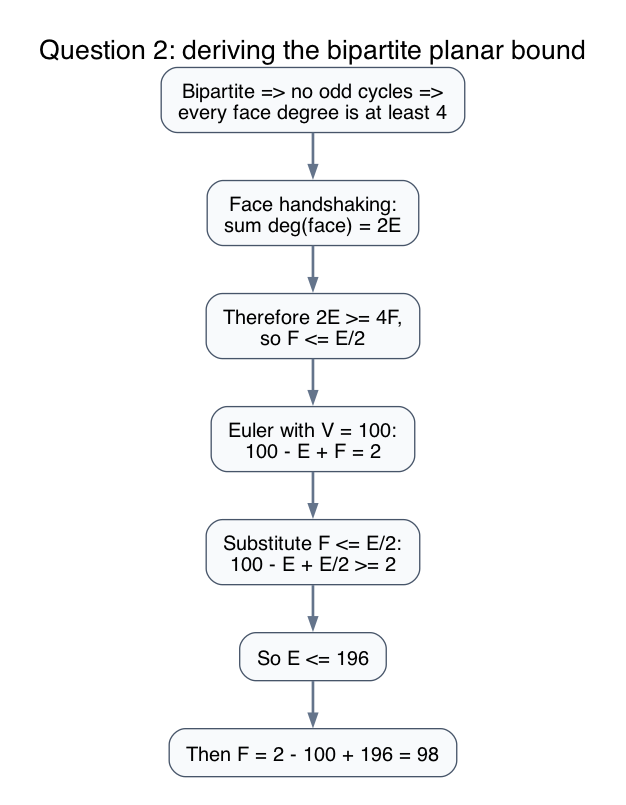
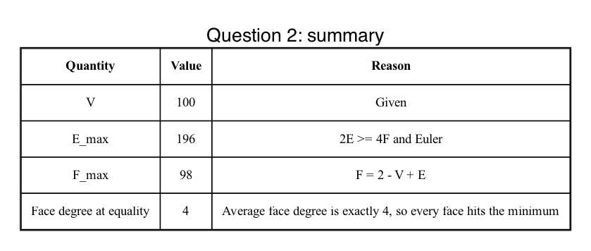
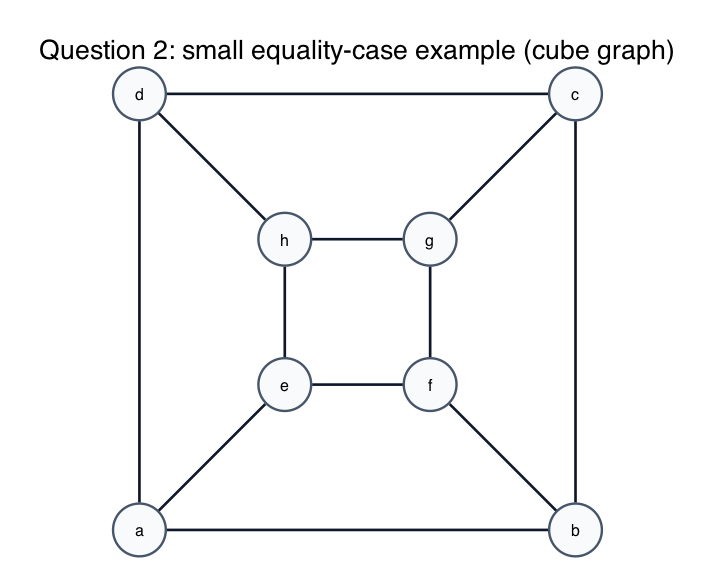

# Question 2: Implicit Structural Bounds

## Question

**The Scenario:** Let `G` be a simple, connected planar graph with exactly `V = 100` vertices. You are told that `G` is strictly bipartite, so it has no odd cycles.

**Your Task:** Determine the absolute mathematical limits of this graph using Euler's formula `V - E + F = 2`.

1. Derive and state the absolute maximum number of edges `E`.
2. Derive and state the absolute maximum number of faces `F`.
3. If the graph achieves this exact maximum number of edges, what is the exact degree of every face? Prove it with the handshaking lemma for faces.

## Answer

- Maximum number of edges: `196`
- Maximum number of faces: `98`
- If equality holds, every face has degree exactly `4`

So an extremal bipartite planar graph with `100` vertices must be a **quadrangulation**.

## Derivation of the edge bound

Because the graph is bipartite, it has no odd cycles. In particular:

- there are no triangles
- every face boundary has length at least `4`

Now use the face-handshaking lemma:

`sum of face degrees = 2E`

Since every face has degree at least `4`,

`2E >= 4F`

so

`F <= E/2`

Now combine that with Euler:

`100 - E + F = 2`

Using `F <= E/2`,

`100 - E + E/2 >= 2`

`100 - E/2 >= 2`

`98 >= E/2`

`E <= 196`

Therefore the absolute maximum is:

`E_max = 196`

## Derivation of the face bound

Plug the edge maximum into Euler:

`F = 2 - V + E = 2 - 100 + 196 = 98`

So:

`F_max = 98`

## Why every face must have degree 4 at equality

If `E = 196`, then `F = 98`.

The face-handshaking lemma gives

`2E = sum of face degrees = 392`

But

`4F = 4(98) = 392`

So the lower bound

`sum of face degrees >= 4F`

is actually an equality.

That can happen only if **every single face** hits the minimum possible degree:

`deg(face) = 4`

for all faces.

So equality forces the graph to be a quadrangulation.

The picture below is a smaller exact equality-case example: the cube graph is planar, bipartite, has `E = 2V - 4`, and every face is a 4-cycle.

## Final answer

1. `E_max = 196`
2. `F_max = 98`
3. If `E = 196`, then every face has degree exactly `4`

## Fundamentals

- **Connected planar Euler formula.**
  `V - E + F = 2`

- **Face handshaking.**
  Each edge borders two faces, so `sum deg(face) = 2E`.

- **Bipartite means no triangles.**
  Therefore every face length is at least `4`.

- **Equality case.**
  When a planar bipartite graph reaches `E = 2V - 4`, all faces must be quadrilaterals.
