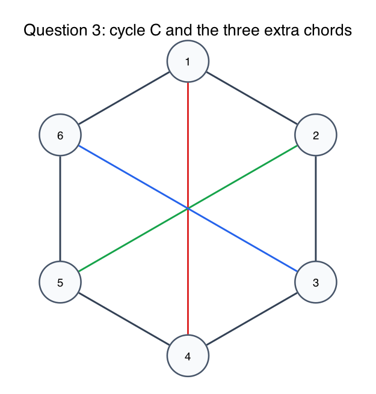
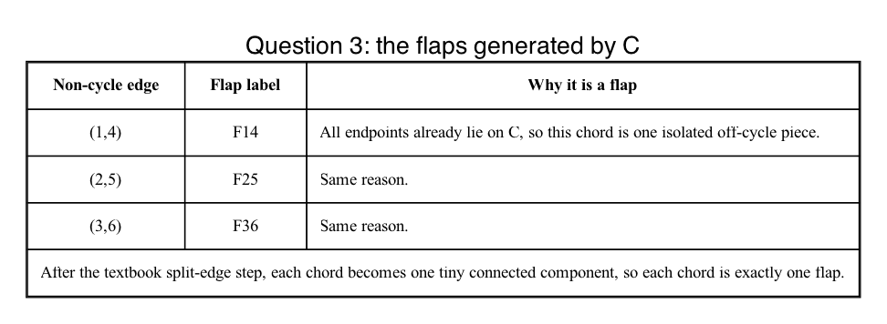
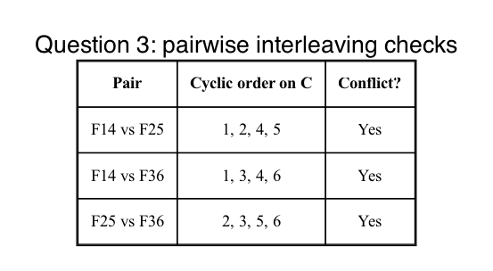
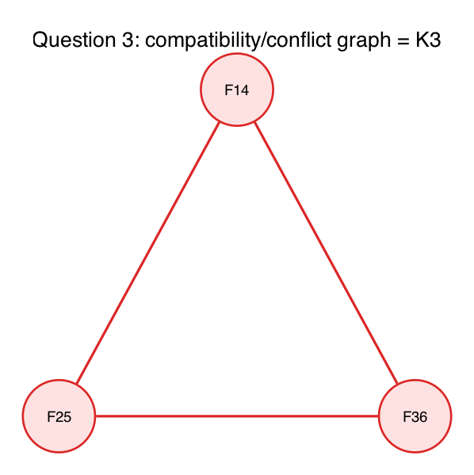
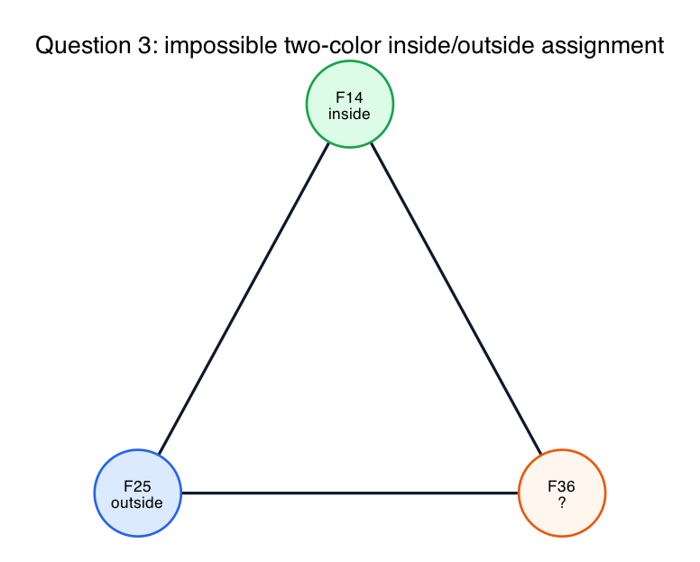

# Question 3: Mechanical Tracing via Data Structures

## Question

**The Scenario:** You are given the graph

`graph = { 1:[2,6,4], 2:[1,3,5], 3:[2,4,6], 4:[3,5,1], 5:[4,6,2], 6:[5,1,3] }`

and you are told to test planarity using the cycle

`C = [1,2,3,4,5,6,1]`

**Your Task:** Mechanically trace the flap-test algorithm without drawing the full graph.

1. List the exact flaps generated by this cycle.
2. Construct the compatibility graph and list its conflict edges.
3. Determine whether the compatibility graph is bipartite, and conclude whether the original graph is planar.

## Step 1: Read the adjacency list

The cycle edges are:

- `(1,2)`
- `(2,3)`
- `(3,4)`
- `(4,5)`
- `(5,6)`
- `(6,1)`

The only non-cycle edges are:

- `(1,4)`
- `(2,5)`
- `(3,6)`

So the graph is exactly:

- a 6-cycle
- plus three opposite chords

## Step 2: List the flaps

Because every vertex of the graph already lies on the cycle `C`, there are no off-cycle vertex blobs.

So each non-cycle chord becomes its own flap.

The flaps are:

- `F14 = {(1,4)}`
- `F25 = {(2,5)}`
- `F36 = {(3,6)}`

If you perform the textbook split-edge step first, each chord becomes a two-edge path through a dummy vertex, and after removing the cycle vertices each dummy vertex is its own connected component. That is why each chord corresponds to one flap.

## Step 3: Build the compatibility/conflict graph

The compatibility-graph vertices are:

- `F14`
- `F25`
- `F36`

Now check interleaving around the cycle `1,2,3,4,5,6`.

### `F14` versus `F25`

The endpoints appear in cyclic order:

`1,2,4,5`

So they interleave. Therefore:

- `F14` conflicts with `F25`

### `F14` versus `F36`

The endpoints appear in cyclic order:

`1,3,4,6`

So they interleave. Therefore:

- `F14` conflicts with `F36`

### `F25` versus `F36`

The endpoints appear in cyclic order:

`2,3,5,6`

So they interleave. Therefore:

- `F25` conflicts with `F36`

So the conflict graph is:

- `F14-F25`
- `F14-F36`
- `F25-F36`

That is the complete graph `K3`.

## Step 4: Bipartite test

`K3` is a triangle.

A triangle is an odd cycle, and odd cycles are not bipartite.

So the compatibility graph is **not bipartite**.

That means the three flaps cannot be assigned consistently to just two sides of the cycle (`inside` and `outside`) without creating a crossing.

Therefore the original graph is **not planar**.

This matches the hidden structure: the graph is exactly `K3,3` with bipartition

- `{1,3,5}`
- `{2,4,6}`

## Final answer

1. Flaps:
   - `F14 = {(1,4)}`
   - `F25 = {(2,5)}`
   - `F36 = {(3,6)}`
2. Compatibility/conflict graph:
   - vertices: `F14, F25, F36`
   - edges: `F14-F25`, `F14-F36`, `F25-F36`
3. The conflict graph is `K3`, which is not bipartite, so the original graph is not planar.

## Fundamentals

- **Flaps.**
  A flap is a connected off-cycle piece attached to the chosen cycle.

- **Chords as flaps.**
  When all graph vertices already lie on the cycle, each extra chord becomes its own flap.

- **Conflict edge.**
  Two flaps conflict when their attachment points interleave around the cycle.

- **Bipartite test.**
  The flap test succeeds only when the conflict graph is bipartite, because that is what lets you place flaps on two sides of the cycle.
