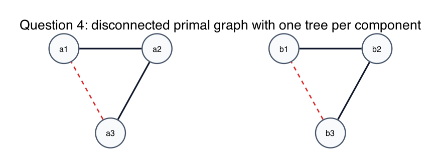
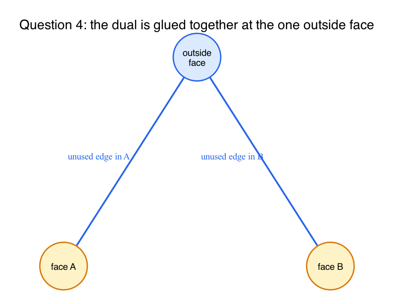
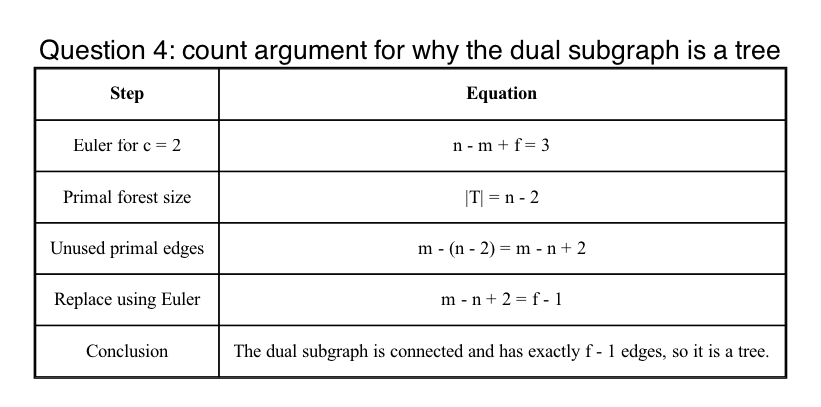

# Question 4: The Edge-Case Definition Trap

## Question

**The Scenario:** Suppose `G` is a planar graph that is **not connected**. It consists of two disjoint planar components `A` and `B`, drawn side-by-side. A student picks a spanning tree `T_A` of `A` and a spanning tree `T_B` of `B`, and defines

`T = T_A union T_B`

The question is whether the dual edges crossing the unused primal edges form a valid connected spanning tree `T*` of the dual graph `G*`.

**Your Task:**

- Answer yes or no.
- Explain mechanically what happens to the single infinite outside face in the dual.
- Explain how that outside-face structure interacts with `T_A` and `T_B`.

## Answer

**Yes.**

Even though `T = T_A union T_B` is only a spanning **forest** in the primal, the unused dual edges still form a connected spanning tree in the dual.

The key reason is that the two primal components share **one single outside face**, and in the dual that becomes **one single outside-face vertex**.

## The mechanical picture

Take the simplest concrete example:

- component `A` is one triangle
- component `B` is another triangle
- in each component, choose two tree edges and leave one edge unused

In the primal:

- `T_A` is a tree on `A`
- `T_B` is a tree on `B`
- `T = T_A union T_B` is a spanning forest with two components

In the dual:

- there is one dual vertex for the inside face of `A`
- one dual vertex for the inside face of `B`
- and one dual vertex for the single outside face surrounding **both** components

Each unused primal edge contributes one dual edge from its component's inside face to the common outside-face vertex.

So the dual edges are not separated into two disconnected pieces. They are glued together at the outside-face vertex.

That makes the dual connected.

## Why it is a tree, not just a connected graph

Let the whole disconnected graph have:

- `n` primal vertices
- `m` primal edges
- `f` faces
- `c = 2` connected components

Euler's formula for a planar graph with `c` connected components is:

`n - m + f = 1 + c = 3`

So:

`f = m - n + 3`

Now count edges in the student's primal forest.

Because each component contributes a spanning tree:

`|T| = (n_A - 1) + (n_B - 1) = n - 2`

Therefore the number of unused primal edges is:

`m - (n - 2) = m - n + 2`

Using the Euler equation above:

`m - n + 2 = f - 1`

So the dual subgraph formed by unused edges has exactly `f - 1` edges.

But it is also connected, because the outside face is shared.

A connected graph on `f` vertices with exactly `f - 1` edges is a tree.

Therefore the unused dual edges form a valid spanning tree `T*` of the dual.

## What the trap is

The trap is thinking:

- disconnected primal graph
- therefore disconnected dual graph

That is false.

The dual is glued together by the single outside face.

So the right general statement is:

- for a connected plane graph, complement of a primal spanning tree gives a dual spanning tree
- for a disconnected plane graph, complement of a primal spanning forest with one tree per component still gives a dual spanning tree

because all componentwise dual trees meet at the same outside-face vertex.

## Final answer

- Answer: **Yes**
- Reason: the dual graph has one shared outside-face vertex, so the dual trees from the separate components glue together there
- Count check: the unused dual edges have exactly `f - 1` edges and are connected, so they form a spanning tree

## Fundamentals

- **Dual graph of a disconnected plane graph.**
  Different components still share the same outside face.

- **Primal forest versus dual tree.**
  One spanning tree per primal component is enough; the complement can still be a single dual tree.

- **Euler for multiple components.**
  With `c` connected components, `n - m + f = 1 + c`.

- **Tree count test.**
  Connected plus exactly `f - 1` edges means the dual subgraph is a tree.
