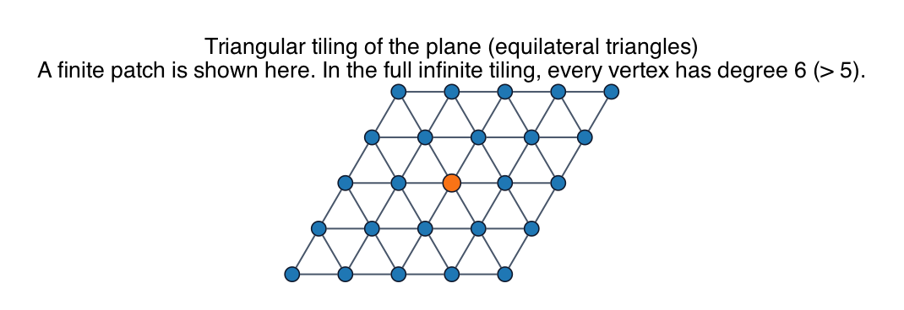

# PS10 Problem 1

Describe a tiling of the plane whose vertices and edges form an infinite planar graph in which every vertex has degree greater than five.

The picture in this folder shows a finite patch of the triangular tiling:

## Solution

Use the tiling of the plane by **equilateral triangles**.

In the full infinite tiling, exactly six triangles meet at every vertex. Equivalently, every vertex has six neighboring vertices, so every vertex has degree

`6 > 5`.

Therefore the infinite graph formed by the vertices and edges of the triangular tiling is an infinite planar graph in which every vertex has degree greater than five.

### Why do some vertices in the picture have smaller degree?

Because the image is only a finite crop of the infinite tiling.

At the boundary of the crop, some edges that would continue outward are not shown. So boundary vertices in the picture can appear to have degree `2`, `3`, or `4`.

That does **not** mean the infinite graph has low-degree vertices. In the full plane tiling, every vertex is an interior vertex and has degree `6`.

## Fundamentals

- **Planar graph from a tiling.** A tiling gives a planar graph by placing vertices at corner points and edges along tile boundaries.

- **Infinite versus finite.** The problem asks about the infinite graph, not about a bounded patch drawn on paper.

- **Vertex degree.** The degree of a vertex is the number of incident edges. In the triangular tiling, six edges meet at every vertex.

- **Why this contrasts with finite planar graphs.** Finite planar graphs always have a vertex of degree at most five, but that finite-graph argument does not extend to all infinite planar graphs.
