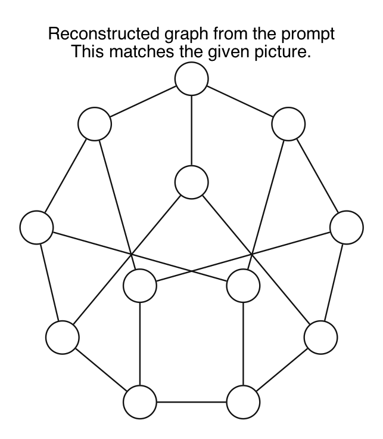
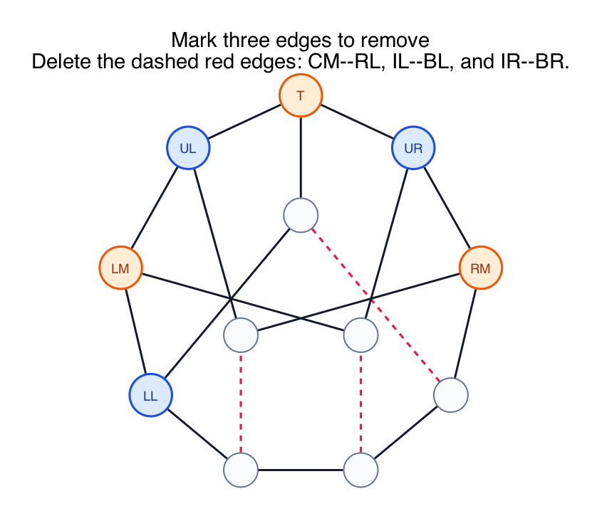
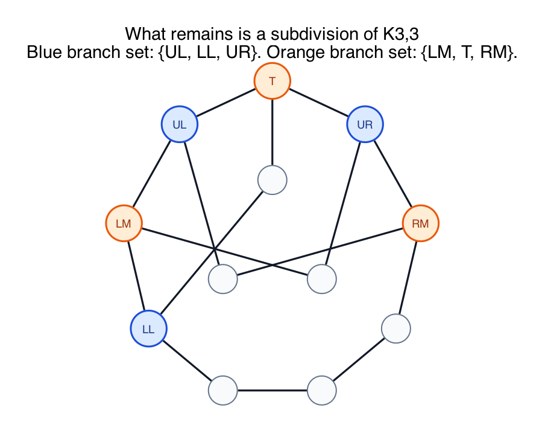
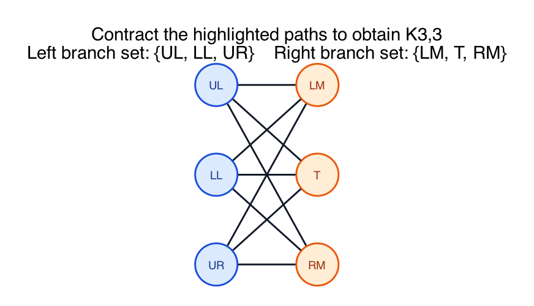

# PS10 Problem 2

Prove that the pictured graph is not planar by finding a subdivision of `K5` or `K3,3` in it.

This folder uses a `K3,3` subdivision.

## What the problem is really asking

You do **not** have to redraw the whole graph without crossings.

You do **not** have to prove nonplanarity by Euler's formula.

Instead, you want to show that **inside the given graph** there is a smaller subgraph that behaves like `K3,3`, except that some of its edges may have been stretched into paths.

That is exactly what a **subdivision** means.

## Step 1: Start from the original graph

Here is the reconstructed graph from the problem statement:

The six important branch vertices will be:

- Left side: `UL`, `LL`, `UR`
- Right side: `LM`, `T`, `RM`

These names mean:

- `T` = top
- `UL` = upper-left
- `UR` = upper-right
- `LM` = left-middle
- `LL` = lower-left
- `RM` = right-middle

The remaining unlabeled vertices will only be used as internal path vertices.

## Step 2: Delete the edges you do not need

To prove there is a subdivision of `K3,3`, you are allowed to delete edges.

Why is that allowed?

Because a subdivision only needs to appear as a **subgraph** of the original graph. A subgraph is obtained by deleting edges and vertices.

Delete these three edges:

- `CM -- RL`
- `IL -- BL`
- `IR -- BR`

Those are the dashed red edges below:

## Step 3: What remains is the candidate `K3,3` subdivision

After deleting those three edges, the remaining graph is:

Now split the branch vertices into the two parts of the bipartition:

- Left part: `{UL, LL, UR}`
- Right part: `{LM, T, RM}`

To get a subdivision of `K3,3`, we need a path from **each** left-side vertex to **each** right-side vertex, and these nine paths must be internally disjoint.

## Step 4: List all nine required paths

Here are the nine left-to-right connections.

### From `UL`

1. `UL` to `LM`: `UL - LM`
2. `UL` to `T`: `UL - T`
3. `UL` to `RM`: `UL - IL - RM`

### From `LL`

4. `LL` to `LM`: `LL - LM`
5. `LL` to `T`: `LL - CM - T`
6. `LL` to `RM`: `LL - BL - BR - RL - RM`

### From `UR`

7. `UR` to `LM`: `UR - IR - LM`
8. `UR` to `T`: `UR - T`
9. `UR` to `RM`: `UR - RM`

This is exactly the adjacency pattern of `K3,3`.

## Step 5: Check the subdivision condition carefully

The only thing left to verify is that the paths do not improperly overlap.

The internal vertices used above are:

- `UL - IL - RM` uses internal vertex `IL`
- `LL - CM - T` uses internal vertex `CM`
- `LL - BL - BR - RL - RM` uses internal vertices `BL`, `BR`, `RL`
- `UR - IR - LM` uses internal vertex `IR`

All other listed paths are single edges, so they have no internal vertices.

Now compare the internal-vertex sets:

- `{IL}`
- `{CM}`
- `{BL, BR, RL}`
- `{IR}`

These sets are pairwise disjoint.

That is exactly what we need: the nine left-to-right edges of `K3,3` have been replaced by internally disjoint paths.

So the remaining graph is a **subdivision of `K3,3`**.

## Step 6: Why this proves the original graph is not planar

`K3,3` is not planar.

A subdivision of a nonplanar graph is also nonplanar.

So the subgraph shown above is nonplanar.

But if the original graph were planar, then **every** subgraph of it would also be planar.

That is impossible.

Therefore, the original graph is **not planar**.

## Optional Step 7: Why the final picture can be "shrunk" to `K3,3`

This last image is only for intuition:

You can "smooth out" degree-2 path vertices:

- `UL - IL - RM` becomes `UL - RM`
- `LL - CM - T` becomes `LL - T`
- `UR - IR - LM` becomes `UR - LM`
- `LL - BL - BR - RL - RM` becomes `LL - RM`

After smoothing these path vertices, the graph literally becomes `K3,3` on the six branch vertices

- `{UL, LL, UR}`
- `{LM, T, RM}`

This smoothing step is **not required** for the proof. It is just a visual way to recognize the subdivision.

## A clean homework-style final answer

Let the branch vertices be

- `{UL, LL, UR}` and `{LM, T, RM}`.

Delete the edges `CM-RL`, `IL-BL`, and `IR-BR`.

In the remaining graph, the nine left-right connections are:

- `UL-LM`
- `UL-T`
- `UL-IL-RM`
- `LL-LM`
- `LL-CM-T`
- `LL-BL-BR-RL-RM`
- `UR-IR-LM`
- `UR-T`
- `UR-RM`

The internal vertices on these paths are `IL`, `CM`, `IR`, `BL`, `BR`, and `RL`, and they are all distinct. Therefore the remaining graph is a subdivision of `K3,3`. Since `K3,3` is nonplanar, the original graph is nonplanar as well.

## The hidden facts you are supposed to know

- **Deleting edges is allowed.**
  You are trying to find a nonplanar **subgraph**, so unused edges may be discarded.

- **A subdivision replaces edges by internally disjoint paths.**
  The branch vertices play the role of the original vertices of `K3,3`.

- **Smoothing degree-2 vertices is only a recognition tool.**
  It helps you see `K3,3`, but the actual proof is already complete once you list the nine paths and check internal disjointness.

- **This is a Kuratowski-style proof.**
  The theorem says a graph is nonplanar if it contains a subdivision of `K5` or `K3,3`.
