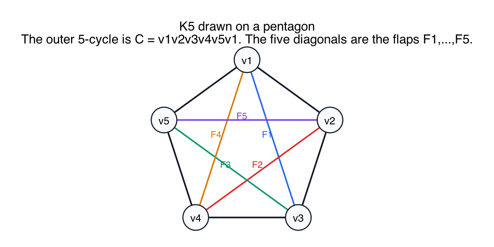
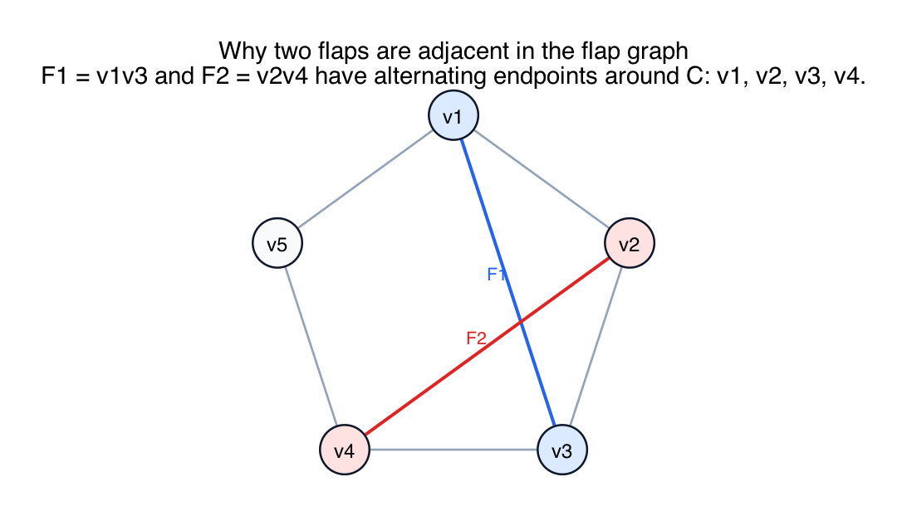
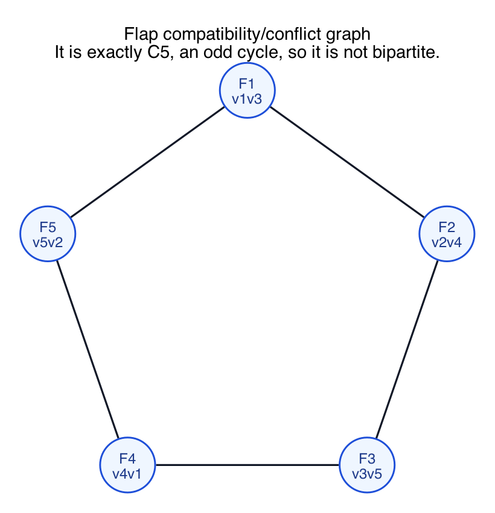

# PS10 Problem 3

In the standard pentagon drawing of `K5`, the five sides of the pentagon form a cycle `C`. This problem asks for the flaps of `C` and for the compatibility graph of those flaps.

The three visuals in this folder are:

- the pentagon drawing of `K5`
- one example of alternating attachments
- the flap graph itself

For a smaller warm-up example using a square with two diagonals, see [simple_square_compatibility_example/README.md](simple_square_compatibility_example/README.md).

For a fuller divide-and-conquer example of the flap test, see [flap_test_divide_and_conquer_example/README.md](flap_test_divide_and_conquer_example/README.md).

## Solution

Label the cycle vertices clockwise as

`v1, v2, v3, v4, v5`.

Then the cycle is

`C = v1v2v3v4v5v1`.

The five edges not on the cycle are the five diagonals:

- `F1 = v1v3`
- `F2 = v2v4`
- `F3 = v3v5`
- `F4 = v4v1`
- `F5 = v5v2`

These are the flaps of the cycle.

### Why are these the flaps?

Once the cycle edges are identified, the only remaining connected pieces attached to the cycle are those five single diagonal edges. Each one attaches to the cycle at exactly two cycle vertices.

### Which flaps conflict?

Two flaps conflict when their attachment points alternate around the cycle. For example:

- `F1` attaches at `{v1, v3}`
- `F2` attaches at `{v2, v4}`

Around the cycle, those four endpoints appear in the alternating order

`v1, v2, v3, v4`,

so the two diagonals cross in the usual pentagon picture and cannot be placed on the same side of the cycle.

Doing this for all five diagonals gives:

- `F1` conflicts with `F2` and `F5`
- `F2` conflicts with `F1` and `F3`
- `F3` conflicts with `F2` and `F4`
- `F4` conflicts with `F3` and `F5`
- `F5` conflicts with `F4` and `F1`

So the flap graph is exactly the 5-cycle

`F1 - F2 - F3 - F4 - F5 - F1`.

That graph is not bipartite, because it is an odd cycle.

### Compatibility versus conflict convention

Some notes define the flap graph using conflicts, while others define it using compatibilities. Here that distinction does not change the answer, because the complement of a 5-cycle is again a 5-cycle.

## Fundamentals

- **Flap.** A flap of a cycle is a connected piece attached to the cycle at one or more attachment vertices.

- **Attachment points.** The important data is where the flap touches the cycle.

- **Alternating attachments.** If the attachment points of two flaps alternate around the cycle, the two flaps cannot be embedded on the same side without crossing.

- **Bipartite test.** A graph is bipartite if and only if it has no odd cycle. Since the flap graph is `C5`, it is not bipartite.
