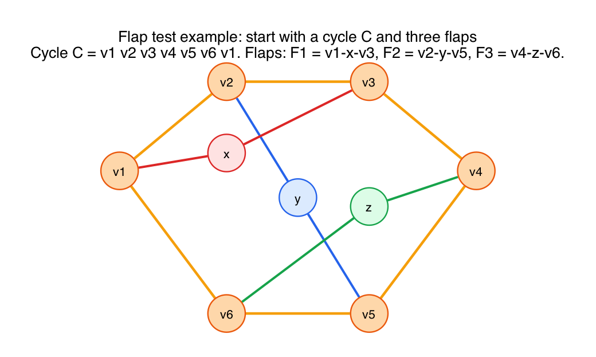
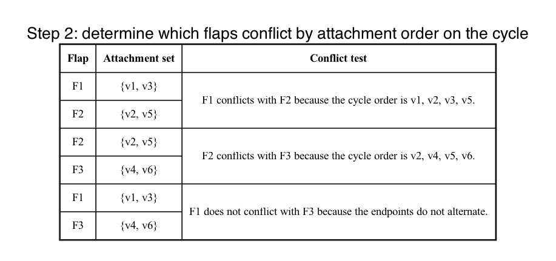
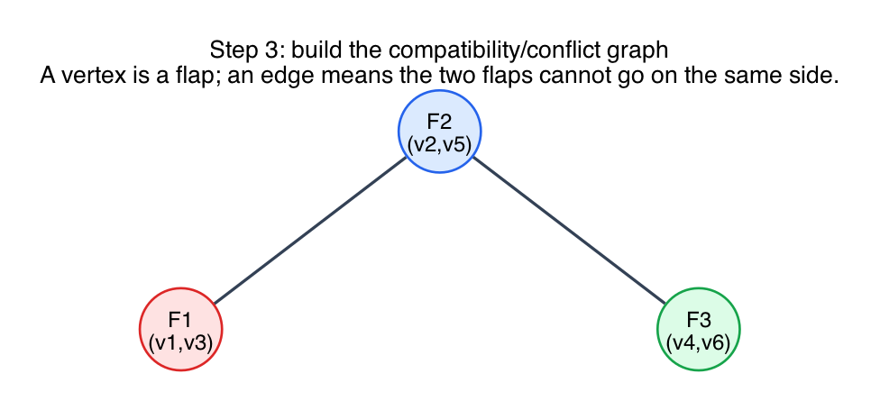
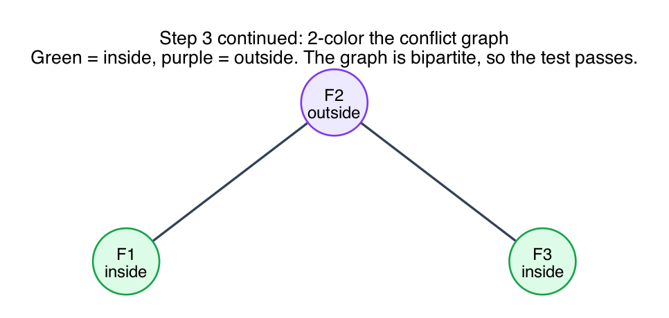
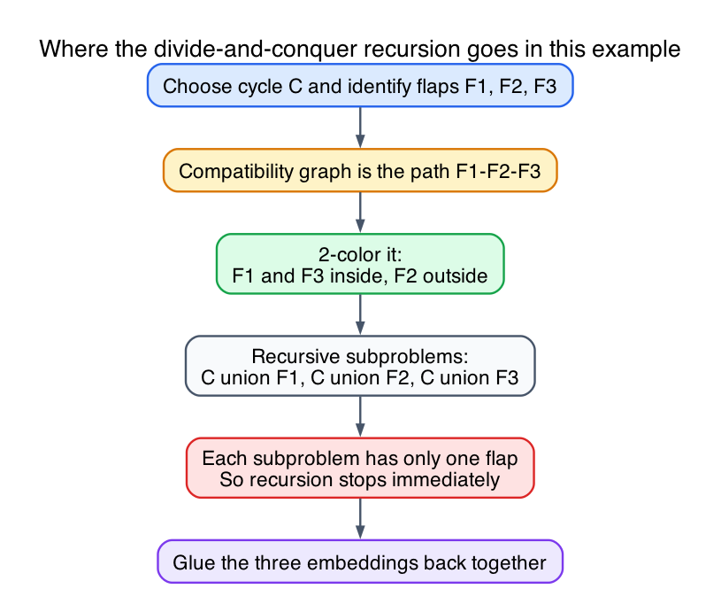
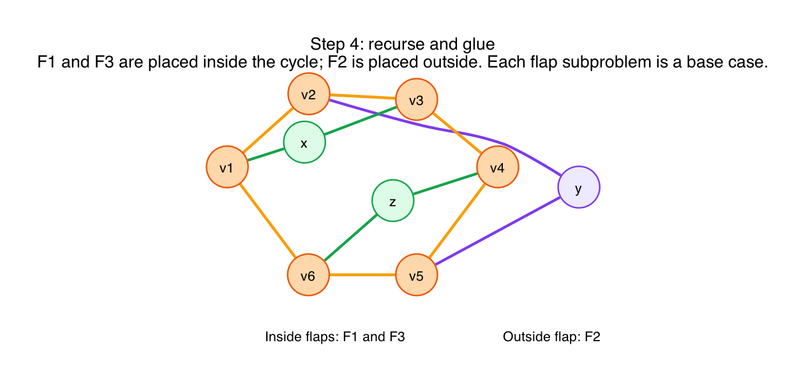

# Flap Test Divide-and-Conquer Example

This is a concrete example of the flap test as a divide-and-conquer planarity algorithm.

The point of the example is to show the full mechanics:

1. isolate a cycle and its flaps
2. build the compatibility/conflict graph
3. test whether that graph is bipartite
4. recurse on each flap-plus-cycle subproblem and glue the embeddings back together

## Step 1: start with a cycle and several flaps

Use the cycle

`C = v1 v2 v3 v4 v5 v6 v1`

and three flaps:

- `F1 = v1 - x - v3`
- `F2 = v2 - y - v5`
- `F3 = v4 - z - v6`

Here is the original graph:

In this clean example, the flaps are already visually obvious, so we do not need to simulate the edge-splitting preprocessing in detail. The off-cycle connected pieces are exactly the three flap paths.

Their attachment sets on the cycle are:

- `F1` attaches at `{v1, v3}`
- `F2` attaches at `{v2, v5}`
- `F3` attaches at `{v4, v6}`

## Step 2: build the compatibility/conflict graph

Two flaps conflict when their attachment points alternate around the cycle.

In this example:

- `F1` conflicts with `F2` because the cycle order is `v1, v2, v3, v5`
- `F2` conflicts with `F3` because the cycle order is `v2, v4, v5, v6`
- `F1` does **not** conflict with `F3`

Conflict checklist:

So the compatibility/conflict graph is:

`F1 - F2 - F3`

Picture:

## Step 3: bipartite test

The conflict graph is a path on three vertices, so it is bipartite.

A valid 2-coloring is:

- `F1 = inside`
- `F2 = outside`
- `F3 = inside`

Picture:

Because a 2-coloring exists, the flap test passes at this cycle.

## Step 4: recurse and glue

Now recurse on each flap-plus-cycle subproblem:

- `C union F1`
- `C union F2`
- `C union F3`

In this example, each subproblem has only one flap, so each recursive call is already a base case. There is no further conflict to test.

Flow of the recursion:

Now glue the sub-embeddings together using the inside/outside assignment:

- put `F1` inside
- put `F3` inside
- put `F2` outside

That gives a planar embedding:

## Why this example is useful

This example is just large enough to show the real divide-and-conquer logic:

- there is more than one flap
- some pairs conflict and some do not
- the compatibility graph is nontrivial
- the recursion step is visible
- the final gluing step is easy to picture

## What this teaches

- **The flap test converts geometry into graph coloring.**
  You stop asking "Can I draw these curves without crossing?" and instead ask "Can I 2-color the conflict graph?"

- **The flaps are the recursive subproblems.**
  Once the cycle is fixed, each flap is handled separately.

- **Bipartite means inside/outside assignment exists.**
  That is exactly why bipartiteness is the key structural test.

- **Odd cycle means failure.**
  If the conflict graph had an odd cycle, no inside/outside assignment could satisfy all conflicts.
