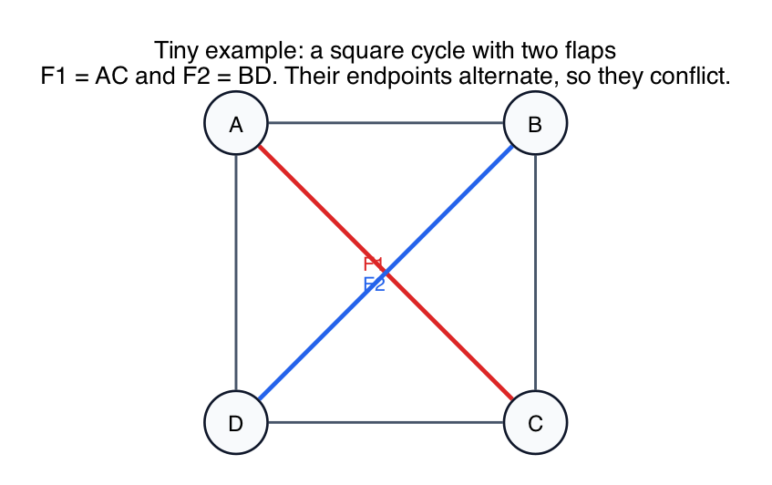
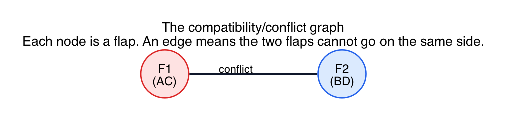
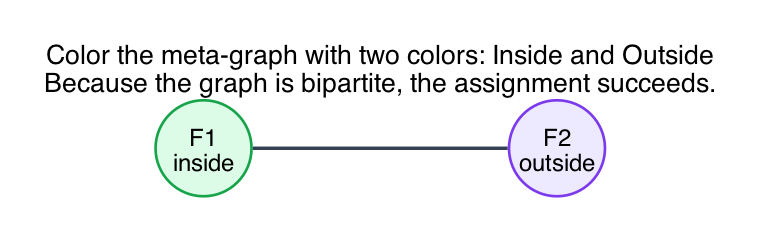
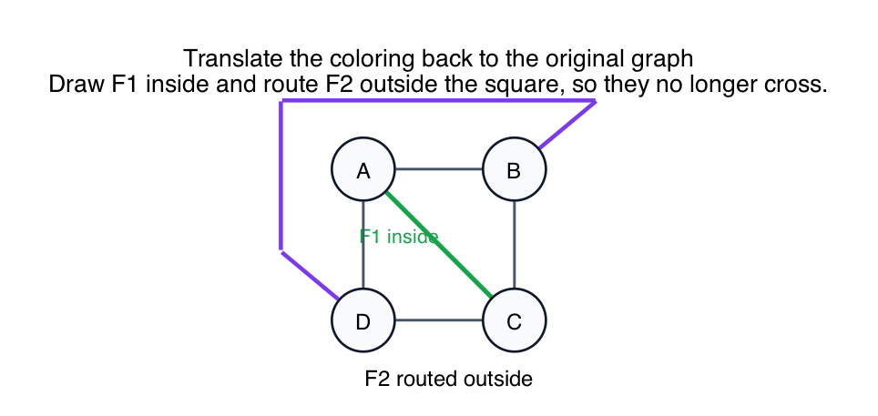

# Tiny Compatibility Graph Example

To understand a compatibility graph, it helps to know the awkward truth:

**"Compatibility graph" is a misleading name.**

In practice, it often behaves like a **conflict graph**.

You are not recording which flaps cooperate nicely. You are recording which flaps **cannot** be placed on the same side of the cycle.

This folder uses the smallest useful example:

- start with a square cycle `A-B-C-D-A`
- add two flaps:
  - `F1 = AC`
  - `F2 = BD`

## Step 1: start with the original geometry problem

Here is the original graph:

The cycle is the square `A-B-C-D-A`.

The two extra edges are:

- `F1 = AC`
- `F2 = BD`

Why do they conflict?

Because their endpoints alternate around the cycle:

`A, B, C, D`

That means:

- if you try to draw both flaps on the **inside** of the square, they cross
- so they cannot live on the same side

## Step 2: build the meta-graph

Now forget the geometry for a moment and build a second graph whose job is only to track conflicts.

In the meta-graph:

- each node represents a flap from the original graph
- each edge means those two flaps cannot be put on the same side

For this example, the meta-graph is:

It has:

- one node for `F1`
- one node for `F2`
- one edge between them, because they conflict

This is the key trick: you replaced a drawing problem with a graph problem.

## Step 3: color the meta-graph

Now interpret the two colors as:

- **inside**
- **outside**

A proper 2-coloring means:

- no two conflicting flaps get the same side

For this example, the coloring is easy:

One valid assignment is:

- `F1` goes inside
- `F2` goes outside

Because the meta-graph is just a single edge, it is bipartite.

## Step 4: translate the coloring back to the original graph

Now return to the original square and obey the coloring:

- draw `F1` inside
- route `F2` outside

That gives:

The two flaps no longer cross, so this example is planar.

## What this example teaches

- **A compatibility graph is a tool, not the original graph.**
  You build it temporarily to answer a geometric question about the original drawing.

- **Its nodes are flaps.**
  You are not tracking the cycle vertices anymore. You are tracking the extra pieces attached to the cycle.

- **Its edges represent conflict.**
  An edge means "these two flaps cannot be placed on the same side."

- **Bipartite means success.**
  If the meta-graph can be 2-colored, then you can split the flaps into inside and outside without creating a crossing conflict.

- **Odd cycle means failure.**
  If the meta-graph has an odd cycle, then two colors are not enough, and that is exactly when the planarity test breaks.

## Connection back to the pentagon problem

In the `K5` pentagon problem, there are five flaps instead of two.

Their conflict graph becomes a 5-cycle:

`F1 - F2 - F3 - F4 - F5 - F1`

That graph is not bipartite, so you cannot assign all five flaps to inside/outside without forcing a conflict. That is why the original drawing is non-planar.
