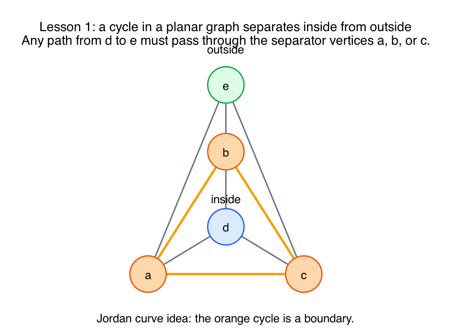
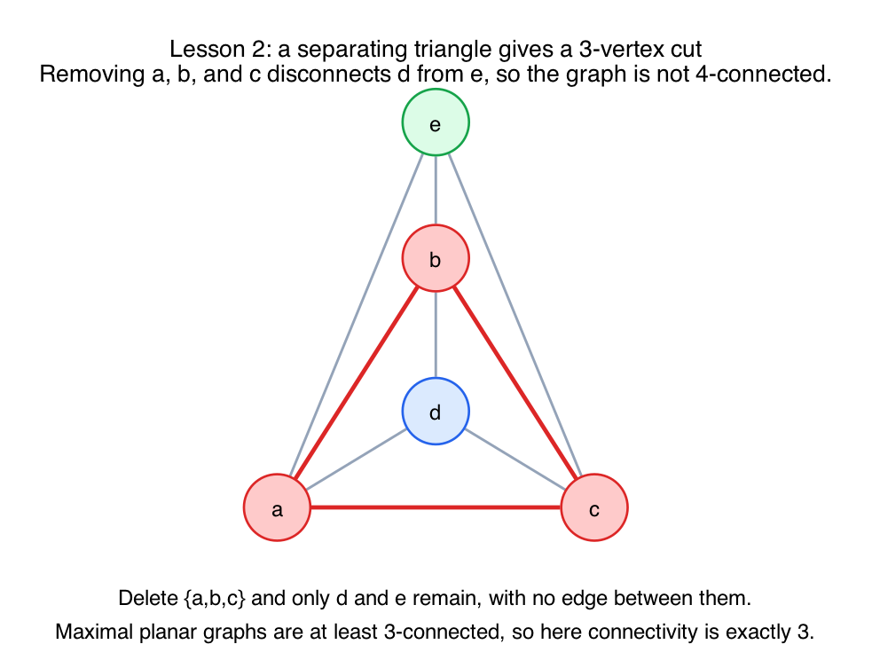
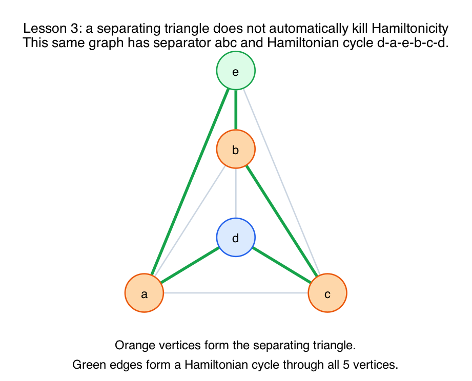

# PS10 Problem 4: What a Separating Triangle Is Really Teaching

This note expands the basic answer to the problem.

The short answer to the original problem is still:

- No, not every triangle in a maximal planar graph is a face.
- A standard counterexample is the **triangular bipyramid**.
- The triangle `abc` is a triangle in the graph, but it is **not** a face because it separates vertex `d` from vertex `e`.

Here is the counterexample with labels:

## What Gemini is getting at

Gemini's first two ideas are basically right:

1. a cycle in a planar embedding creates an inside and an outside
2. a separating triangle acts like a 3-vertex cut

But the Hamiltonian claim needs one correction:

- a separating triangle does **not** automatically mean the graph has no Hamiltonian cycle
- it only means you lose a very strong structural guarantee

So the right lesson is slightly more precise than the simplified "ant" story.

## Lesson 1: inside versus outside

The topological idea is the **Jordan curve theorem**:

- a simple closed curve in the plane separates the plane into an inside region and an outside region
- any path from a point inside to a point outside must cross the curve

In a planar graph, a cycle plays the role of that curve.

In this example, the triangle `abc` is a cycle. Vertex `d` is on one side of it and vertex `e` is on the other side.

That means any path from `d` to `e` must touch the cycle somewhere. In this graph, the only vertices of the cycle are `a`, `b`, and `c`, so every `d-e` path must pass through one of those three vertices.

This is why separating cycles matter: they divide the graph into regions that can only communicate through a small boundary.

## Lesson 2: 3-connected versus 4-connected

A graph is:

- **3-connected** if removing any two vertices still leaves it connected
- **4-connected** if removing any three vertices still leaves it connected

For maximal planar graphs with at least four vertices, a standard theorem says:

- every maximal planar graph is at least **3-connected**

Now suppose a maximal planar graph has a separating triangle `abc`.

If you remove `a`, `b`, and `c`, then the inside part and outside part can no longer communicate at all. In this example, removing `a`, `b`, and `c` leaves only `d` and `e`, and they are disconnected.

So:

- the graph is **not** 4-connected
- its vertex connectivity is at most `3`

Combining that with the fact that maximal planar graphs are at least 3-connected, you get:

- a maximal planar graph with a separating triangle is **exactly 3-connected**

That is the clean structural reason separating triangles are important.

## Lesson 3: what is true about Hamiltonian cycles

This is the place where the quick analogy needs a correction.

A separating triangle is **bad news** for Hamiltonian arguments, but it is not an automatic contradiction.

What is true is:

- every 4-connected planar graph is Hamiltonian
- in a maximal planar graph, having **no** separating triangle is a strong way to get 4-connectivity

So in this setting:

- **no separating triangle** gives you a strong Hamiltonian theorem
- **having** a separating triangle means you no longer get that theorem for free

But that does **not** mean the graph is non-Hamiltonian.

In fact, this very counterexample has a Hamiltonian cycle:

`d - a - e - b - c - d`

The green edges below show one such cycle:

So the precise statement is:

- separating triangles are obstacles to the clean 4-connected Hamiltonian theory
- they do not, by themselves, forbid Hamiltonian cycles

## What the original problem is testing

For this practice-set problem, the instructor is mainly testing whether you can distinguish:

- a **triangle as a cycle**
- a **triangle as a face**

Those are not the same thing.

The triangular bipyramid shows the difference:

- every face is a triangle
- but the triangle `abc` is a **separating triangle**, not a face

Its actual faces are:

- `abd`
- `bcd`
- `cad`
- `abe`
- `bce`
- `cae`

## Exam-level takeaways

- **A face is embedding-dependent.**
  A triangle is a face only if it bounds one region of the embedding.

- **A separating triangle is a 3-cycle that splits the graph into an inside and an outside.**
  That is why it is not a face.

- **In maximal planar graphs, separating triangles detect exactly where 4-connectivity fails.**

- **Hamiltonian warning.**
  "No separating triangles" is a strong positive condition.
  "Has a separating triangle" is not an automatic negative condition.

- **If you see a cycle surrounding vertices on one side and other vertices on the other side, think separator.**
  That is the main structural idea behind the problem.
