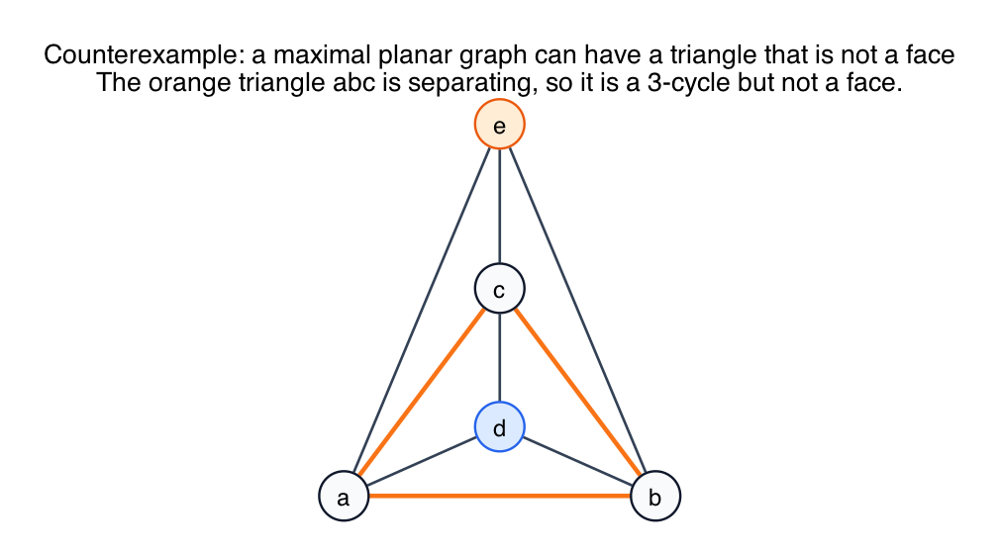

# PS10 Problem 4

Question: in a maximal planar graph, all faces are triangles. Must every triangle also be a face?

The counterexample in this folder is:

For a longer conceptual note on separating triangles, connectivity, and the Hamiltonian-cycle caveat, see [EXPLANATION.md](EXPLANATION.md).

For a worked custom example using a six-vertex "quarantine zone" setup, see [quarantine_zone_worked_example/README.md](quarantine_zone_worked_example/README.md).

## Solution

No. A maximal planar graph can contain a triangle that is **not** a face.

Use the **triangular bipyramid**:

- start with a triangle on vertices `a, b, c`
- add a vertex `d` joined to all of `a, b, c`
- add a vertex `e` joined to all of `a, b, c` on the other side

The graph is maximal planar, but the triangle `abc` is not a face.

### Why is `abc` not a face?

Because the triangle `abc` separates the graph into two regions:

- one side contains `d`
- the other side contains `e`

So the interior of triangle `abc` is not a single face region of the embedding. Instead, the actual faces are:

- `abd`
- `bcd`
- `cad`
- `abe`
- `bce`
- `cae`

### Why is the graph maximal planar?

It already has the maximum possible number of edges for a simple planar graph on `n = 5` vertices:

`3n - 6 = 3(5) - 6 = 9`.

And the triangular bipyramid has exactly `9` edges.

So no additional edge can be added while preserving planarity and simplicity. That is exactly what maximal planar means.

## Fundamentals

- **Face versus cycle.** A triangle in the graph is just a 3-cycle. It is a face only if it bounds one region of the embedding.

- **Maximal planar.** A planar graph is maximal planar if no new edge can be added without destroying planarity.

- **Separating triangle.** A triangle can disconnect the embedding into an inside part and an outside part. Such a triangle is called a separating triangle, and it is not a face.

- **Triangulation does not mean every triangle is a face.** "Every face is a triangle" is not the same statement as "every triangle is a face."
