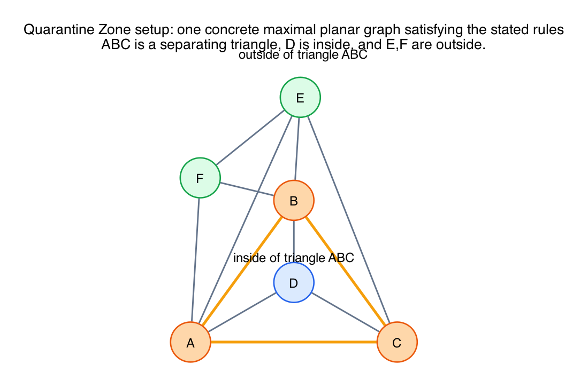
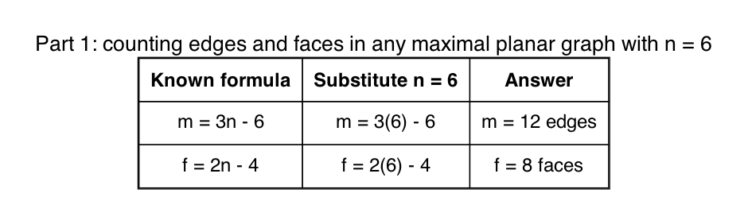
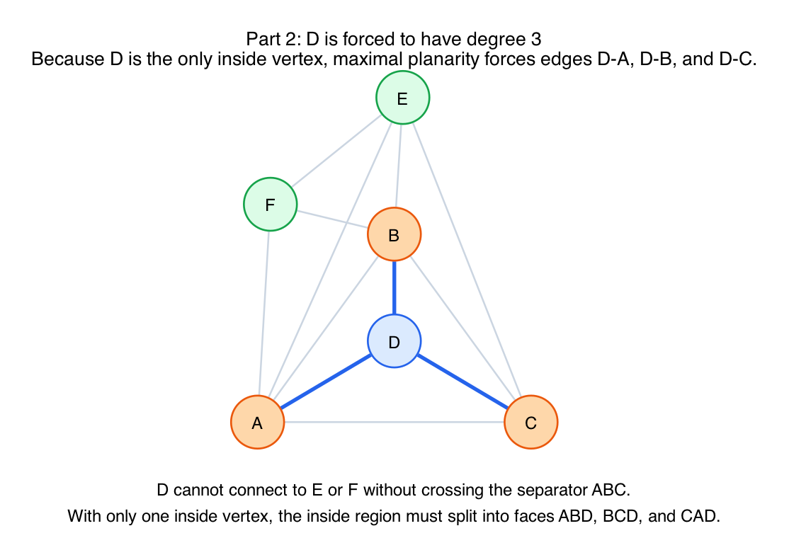
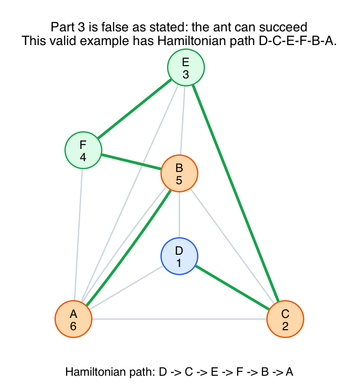

# Quarantine Zone Worked Example

This is a worked response to the custom question:

> You are given a planar graph with six vertices `A, B, C, D, E, F`.
>
> Rules:
>
> - the graph is maximal planar
> - triangle `ABC` is a separating triangle
> - `D` is strictly inside triangle `ABC`
> - `E` and `F` are strictly outside triangle `ABC`
>
> Part 1: find the exact number of edges and faces
>
> Part 2: determine the exact degree of `D` and who it must connect to
>
> Part 3: prove an ant starting at `D` can never complete a Hamiltonian path

## Important correction

Parts 1 and 2 are correct and have exact answers.

Part 3 is **false as stated**.

There is no valid proof that the ant must always fail, because there are maximal planar graphs satisfying all of the stated rules that **do** have a Hamiltonian path starting at `D`.

So the right mathematical answer is:

- solve Parts 1 and 2 exactly
- reject Part 3 as a false universal claim
- give a counterexample

## Picture 1: one valid graph satisfying the rules

This is one concrete maximal planar graph on the six vertices with:

- separating triangle `ABC`
- `D` inside the triangle
- `E` and `F` outside the triangle

The edges in this example are:

- `AB, BC, CA`
- `DA, DB, DC`
- `EA, EB, EC`
- `FA, FB, FE`

That is `12` edges total.

Because the drawing is planar and it already reaches the maximal planar bound `3n - 6 = 12`, it is a valid maximal planar example.

## Part 1: exact number of edges and faces

For any maximal planar graph with `n >= 3`,

- `m = 3n - 6`
- `f = 2n - 4`

Here `n = 6`, so:

- `m = 3(6) - 6 = 12`
- `f = 2(6) - 4 = 8`

So the exact answers are:

- **Edges:** `12`
- **Faces:** `8`

## Part 2: the inside vertex `D`

Because `ABC` is a separating triangle, `D` is trapped on the inside side of that cycle.

That means:

- `D` cannot connect to `E` or `F`
- any such edge would have to cross the boundary triangle `ABC`

Also, because the graph is maximal planar, the inside region bounded by `ABC` must be fully triangulated.

But there is only one vertex inside that region, namely `D`.

Therefore `D` is forced to connect to all three boundary vertices:

- `D-A`
- `D-B`
- `D-C`

So the exact degree of `D` is:

`deg(D) = 3`

and its forced neighbors are exactly:

`A, B, C`

## Part 3: why the claimed proof cannot exist

The question asks you to prove that the ant starting at `D` can never complete a Hamiltonian path.

That statement is false.

To disprove an "always fails" statement, it is enough to give **one** valid counterexample where the ant succeeds.

The graph in Picture 1 is such a counterexample.

It has the Hamiltonian path:

`D -> C -> E -> F -> B -> A`

Check each step:

- `D-C` is an edge
- `C-E` is an edge
- `E-F` is an edge
- `F-B` is an edge
- `B-A` is an edge

This path:

- starts at `D`
- visits all `6` vertices exactly once
- never repeats a vertex

So it is a valid Hamiltonian path.

Therefore the sentence

> the ant will always fail

is mathematically wrong.

## What is actually true

The separating triangle `ABC` **does** impose a strong structural restriction:

- any path from the inside vertex `D` to the outside vertices must go through `A`, `B`, or `C`

So the triangle really is a kind of firewall or bottleneck.

However, that bottleneck is **not** strong enough to forbid Hamiltonian paths in general.

It only tells you that the path must leave the inside region through one of the separator vertices.

In this six-vertex setting, that still leaves enough room for a Hamiltonian path to exist.

## Final answers

- **Part 1:** `12` edges and `8` faces
- **Part 2:** `deg(D) = 3`, and `D` must connect exactly to `A, B, C`
- **Part 3:** false as stated; there is no proof of failure because a counterexample exists

## Fundamentals

- **Maximal planar counting formulas.**
  For a maximal planar graph with `n` vertices, `m = 3n - 6` and `f = 2n - 4`.

- **Separating triangle.**
  A separating triangle is a 3-cycle that has vertices on both sides of it in the embedding.

- **Triangulation inside a boundary.**
  If a region is bounded by a triangle and contains a single interior vertex, maximal planarity forces that vertex to connect to all three boundary vertices.

- **Counterexample logic.**
  To refute a universal claim like "always fails," one valid example where it succeeds is enough.
