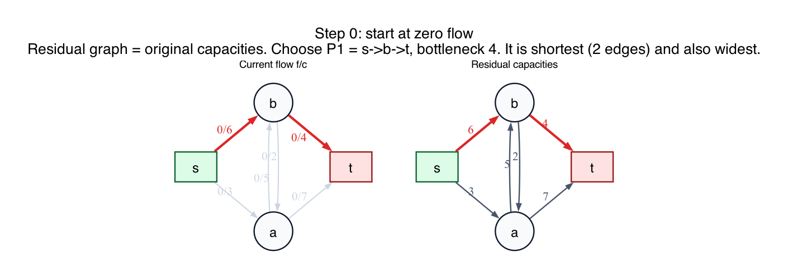
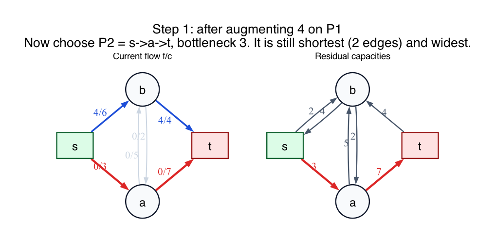

# PS8 Problem 1

Find the sequence of flows and residual graphs produced by repeatedly augmenting along an unweighted shortest residual path from `s` to `t`.

This folder uses the tie-breaking choice `s -> b -> t` first. In the diagrams here, the middle two directed edges are `a -> b` with capacity `5` and `b -> a` with capacity `2`.

## Solution

### Step 0: start from the zero flow

The initial state is shown here:

The residual graph has two shortest `s-t` paths of length `2`:

- `s -> b -> t`, with bottleneck `min(6, 4) = 4`
- `s -> a -> t`, with bottleneck `min(3, 7) = 3`

Choose `s -> b -> t` first and augment by `4`.

### Step 1: after sending 4 units on `s -> b -> t`

The next state is:

Now the shortest residual `s-t` path is `s -> a -> t`, again of length `2`, with bottleneck

`min(3, 7) = 3`.

Augment by `3`.

### Step 2: after sending 3 units on `s -> a -> t`

The third state is:

At this point:

- `s -> a` is saturated
- `b -> t` is saturated

So the only remaining residual `s-t` path is

`s -> b -> a -> t`

with bottleneck

`min(2, 2, 4) = 2`.

Augment by `2`.

### Step 3: final maximum flow

The final state is:

The full augmenting sequence is therefore:

1. `s -> b -> t`, add `4`
2. `s -> a -> t`, add `3`
3. `s -> b -> a -> t`, add `2`

The total flow value is

`4 + 3 + 2 = 9`.

After this, there is no residual edge leaving `s`, so there is no residual path from `s` to `t`. Therefore the flow is maximum.

## Fundamentals

- **Residual graph.** The residual graph tells you where you can still push more flow, or where you can undo previously sent flow.

- **Shortest residual path.** "Shortest" here means the fewest edges, not the largest capacity. This is the Edmonds-Karp idea.

- **Bottleneck capacity.** Once you choose a residual path, the amount you can add is the smallest residual capacity on that path.

- **Why the algorithm stops.** A flow is maximum exactly when there is no augmenting path left in the residual graph.

- **Tie-breaking.** If several residual paths have the same smallest number of edges, any one of them is allowed. A different first choice can change the intermediate steps, but not the final maximum-flow value.
