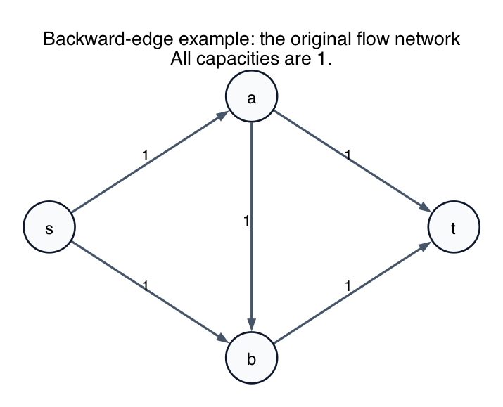
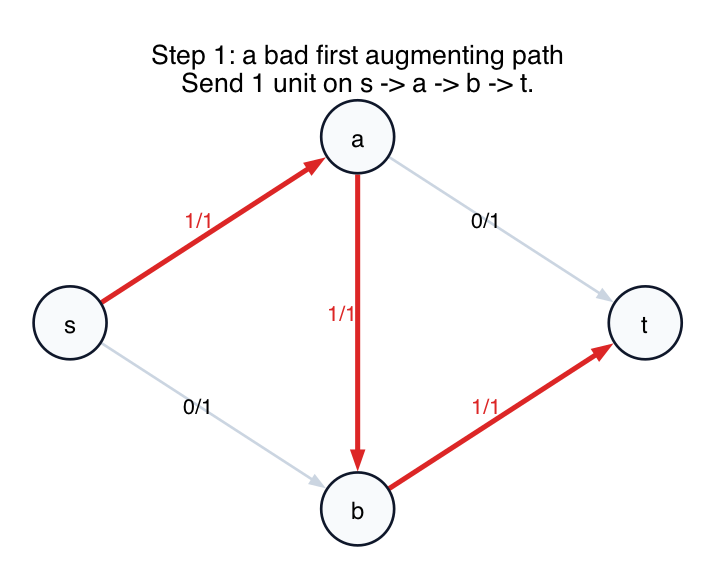
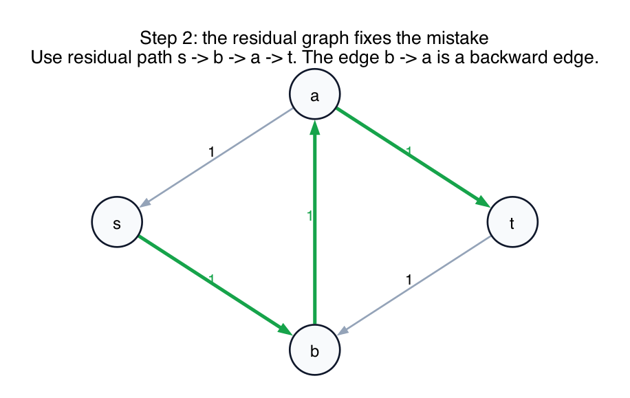
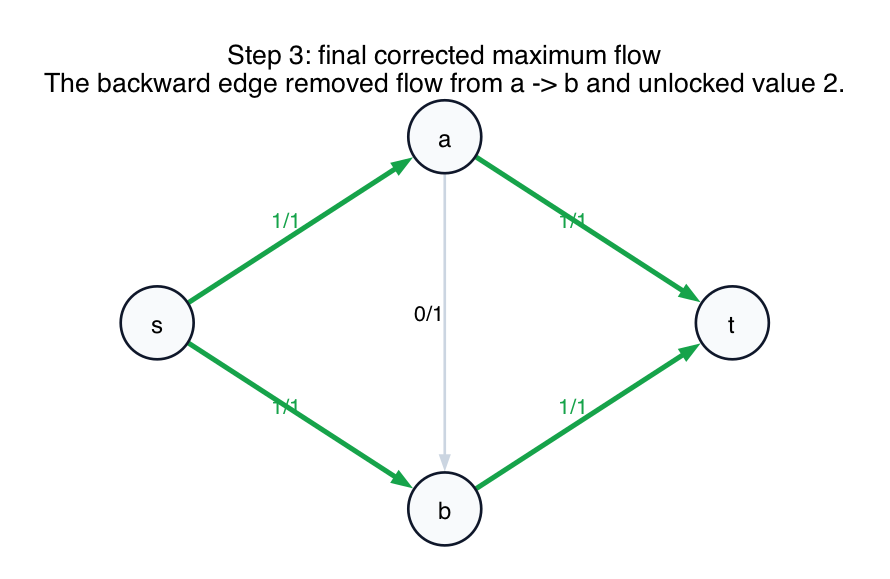
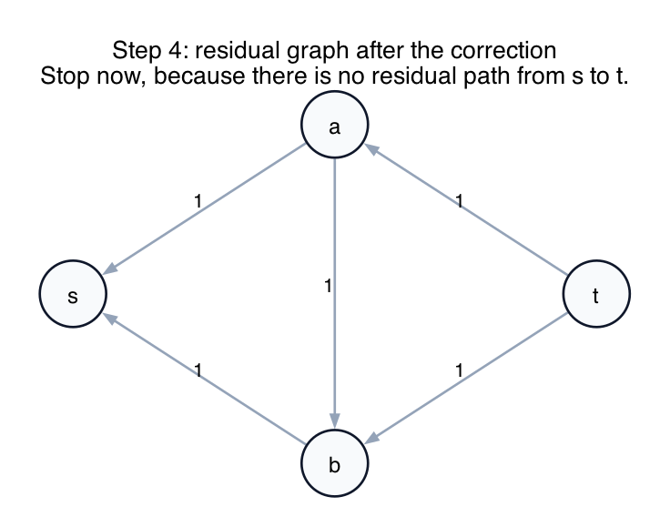

# Backward Edge Example

This is the standard tiny example showing why residual graphs need **backward edges**.

The question is:

> Can a flow algorithm ever need to go backward because it picked a bad path earlier?

Yes.

That is exactly what residual backward edges are for.

## The network

Start with this flow network, where every edge has capacity `1`:

Edges:

- `s -> a`
- `s -> b`
- `a -> b`
- `a -> t`
- `b -> t`

The true maximum flow is `2`, because we can eventually send:

- one unit on `s -> a -> t`
- one unit on `s -> b -> t`

## Step 1: take a bad path first

Suppose the algorithm first augments along:

`s -> a -> b -> t`

That sends `1` unit of flow and gives:

Now three edges are saturated:

- `s -> a`
- `a -> b`
- `b -> t`

If you only looked at the original graph, it would feel like you got stuck with value `1`.

But you are **not** supposed to look only at the original graph.

You must look at the **residual graph**.

## Step 2: the residual graph creates a backward edge

After sending `1` unit on `a -> b`, the residual graph contains the backward edge:

`b -> a`

Why?

Because the algorithm is allowed to **undo** some or all of the flow it previously placed on `a -> b`.

The residual graph now has this augmenting path:

`s -> b -> a -> t`

shown here:

The important part is the middle edge `b -> a`.

That edge does **not** exist in the original network.

It exists only in the residual graph, and it means:

- cancel the old `1` unit on `a -> b`

So this second augmentation does three things at once:

1. sends a new unit on `s -> b`
2. removes the old unit on `a -> b`
3. sends a unit on `a -> t`

## Step 3: the flow is corrected

After that rerouting, the final flow is:

Now the flow uses:

- `s -> a -> t`
- `s -> b -> t`

with total value `2`.

So the algorithm did need to "go backward," but not because it was confused.

It went backward because:

- the first augmenting path used the middle edge `a -> b` in a way that blocked a better arrangement
- the residual graph let the algorithm undo that local mistake and reroute the flow

## The missing decision rule: when do you use a backward edge, and when do you stop?

This is the crucial algorithm rule:

1. Build the residual graph.
2. If there is an `s-t` path in the residual graph, augment along one such path.
3. If that residual path includes a backward edge, use it.
4. If there is **no** residual `s-t` path, stop.

So:

- you do **not** use a backward edge just because one exists somewhere
- you use it only when it lies on a complete residual path from `s` to `t`

In this example, after the bad first path:

- there **is** a residual path `s -> b -> a -> t`
- that path uses the backward edge `b -> a`

So the algorithm continues and augments.

After the correction, the residual graph looks like this:

Now notice the important fact:

- `s` has no outgoing residual edge at all

So there is no residual path from `s` to `t`.

That is exactly when the algorithm stops.

The stopping test is **not**:

- "Are there any backward edges left?"

The stopping test is:

- "Is there any augmenting path from `s` to `t` in the residual graph?"

## What this example teaches

- **Backward residual edges are essential.**
  Without them, augmenting-path algorithms could get trapped in bad early choices.

- **A backward edge means "you may cancel flow here."**
  It is not a new real pipe in the original network.

- **Residual graphs describe flexibility, not just unused capacity.**
  They tell you where you can push more flow and where you can reverse earlier flow.

- **Going backward is really rerouting.**
  The algorithm is not losing flow value. It is rearranging the existing flow to make room for more.

- **Stopping depends on `s-t` reachability.**
  You stop only when the residual graph has no path from `s` to `t`, even if some isolated backward edges still exist elsewhere.
