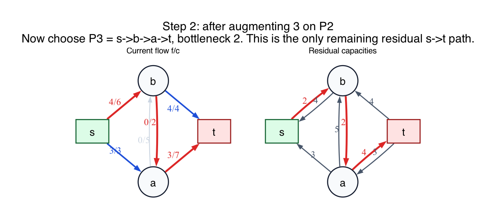

# PS8 Problem 2

Find the sequence of flows and residual graphs produced by repeatedly augmenting along a widest residual path from `s` to `t`.

This folder uses the same network drawing as Problem 1, with `a -> b` of capacity `5` and `b -> a` of capacity `2`.

## Solution

For a residual path, its **width** is the minimum residual capacity on the path. A widest path is one with the largest possible width.

### Step 0: choose the widest initial path

The starting state is:

The main residual `s-t` paths have widths:

- `s -> b -> t`: `min(6, 4) = 4`
- `s -> a -> t`: `min(3, 7) = 3`
- `s -> a -> b -> t`: `min(3, 5, 4) = 3`
- `s -> b -> a -> t`: `min(6, 2, 7) = 2`

So the widest path is `s -> b -> t`, with width `4`.

Augment by `4`.

### Step 1: after sending 4 units on `s -> b -> t`

The next state is:

Now:

- `s -> a -> t` has width `min(3, 7) = 3`
- `s -> b -> a -> t` has width `min(2, 2, 7) = 2`

So the widest path is `s -> a -> t`.

Augment by `3`.

### Step 2: after sending 3 units on `s -> a -> t`

The third state is:

Now the only residual path from `s` to `t` is

`s -> b -> a -> t`

and its width is

`min(2, 2, 4) = 2`.

Augment by `2`.

### Step 3: final maximum flow

The final state is:

So one valid widest-path sequence is:

1. `s -> b -> t`, add `4`
2. `s -> a -> t`, add `3`
3. `s -> b -> a -> t`, add `2`

The resulting maximum flow has value `9`.

## Fundamentals

- **Widest path.** The width of a path is its bottleneck residual capacity. The widest path is the one with the largest bottleneck.

- **Difference from shortest-path augmentation.** Problem 1 chooses by fewest edges. Problem 2 chooses by largest bottleneck. In this network, the two methods can follow the same sequence with the stated tie-breaking.

- **Residual capacities still matter.** Even for the widest-path rule, you always work in the residual graph, not the original graph.

- **Maximum-flow criterion.** Once no residual `s-t` path exists, the current flow is maximum.
