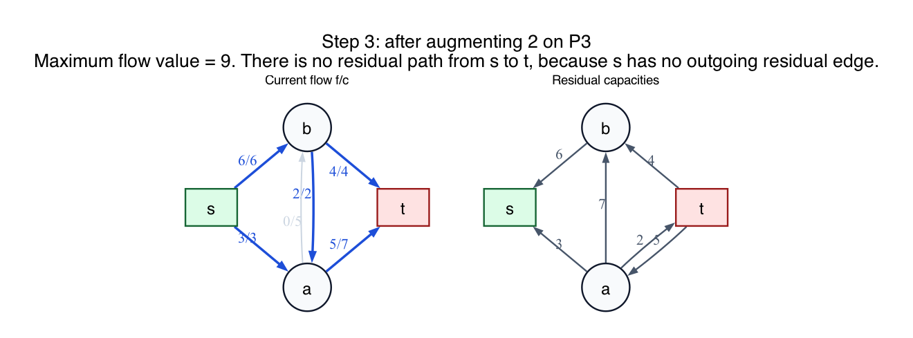
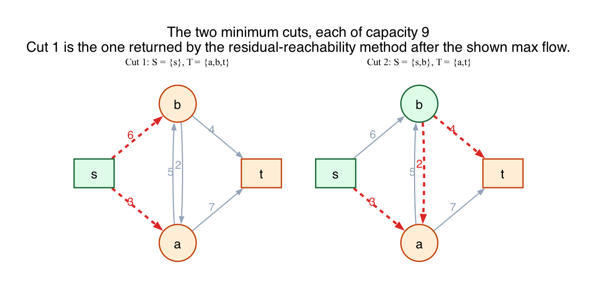

# PS8 Problem 3

This problem asks for the two minimum cuts of the network and asks which one is recovered from the standard residual-reachability method after computing a maximum flow.

The final maximum-flow state used here is:

The two minimum cuts are shown here:

## Solution

There are only four possible `s-t` cuts, depending on whether `a` and `b` are placed with `s` or with `t`.

### Cut 1: `{s} | {a, b, t}`

The edges leaving the source side are:

- `s -> a` of capacity `3`
- `s -> b` of capacity `6`

So this cut has capacity

`3 + 6 = 9`.

### Cut 2: `{s, a} | {b, t}`

The edges leaving the source side are:

- `s -> b` of capacity `6`
- `a -> b` of capacity `5`
- `a -> t` of capacity `7`

So this cut has capacity

`6 + 5 + 7 = 18`.

### Cut 3: `{s, b} | {a, t}`

The edges leaving the source side are:

- `s -> a` of capacity `3`
- `b -> a` of capacity `2`
- `b -> t` of capacity `4`

So this cut has capacity

`3 + 2 + 4 = 9`.

### Cut 4: `{s, a, b} | {t}`

The edges leaving the source side are:

- `a -> t` of capacity `7`
- `b -> t` of capacity `4`

So this cut has capacity

`7 + 4 = 11`.

Therefore the two minimum cuts are:

1. `{s} | {a, b, t}`
2. `{s, b} | {a, t}`

and both have capacity `9`.

### Which cut does the residual-reachability method find?

Start from the final maximum flow and look at the residual graph.

From `s`, there is no residual edge to either `a` or `b`, so the only vertex reachable from `s` is `s` itself.

Therefore the reachable set is `{s}`, and the cut found by the lecture-note method is

`{s} | {a, b, t}`.

## Fundamentals

- **Cut.** An `s-t` cut is a partition of the vertices into a source side containing `s` and a sink side containing `t`.

- **Cut capacity.** The capacity of a cut is the sum of capacities of edges directed from the source side to the sink side.

- **Minimum cut.** A minimum cut is one with smallest possible capacity.

- **Max-flow min-cut theorem.** The value of a maximum flow equals the capacity of a minimum cut. Here both are `9`.

- **Residual reachability method.** After you have a maximum flow, take the set of vertices still reachable from `s` in the residual graph. That reachable set is the source side of a minimum cut.
