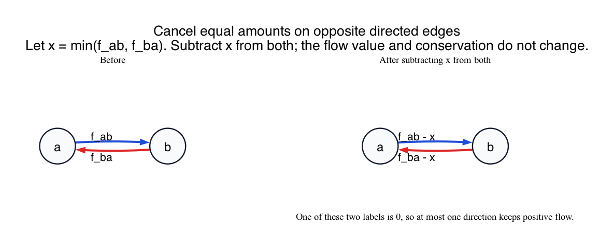

# PS8 Problem 4

Suppose a maximum flow uses both directions of a pair of opposite edges, with flow `f_ab` on `a -> b` and flow `f_ba` on `b -> a`.

The picture in this folder shows the cancellation idea:

## Solution

Let

`x = min(f_ab, f_ba)`.

Create a new flow `f'` by changing only these two edges:

- `f'(a -> b) = f_ab - x`
- `f'(b -> a) = f_ba - x`

and leaving every other edge unchanged.

### Why is this allowed?

Because `x` is the smaller of the two flow values, both new values are still nonnegative.

Also, both values got smaller, so neither one can exceed its edge capacity.

### Why is flow conservation preserved?

At vertex `a`:

- outgoing flow on `a -> b` decreases by `x`
- incoming flow on `b -> a` also decreases by `x`

So the difference between outgoing and incoming flow at `a` stays the same.

At vertex `b` the same thing happens in reverse:

- incoming flow from `a -> b` decreases by `x`
- outgoing flow on `b -> a` decreases by `x`

So flow conservation at `b` is also unchanged.

All other vertices are unchanged.

### Why does the value of the flow stay the same?

The only modification is a cancellation of `x` units moving one way and `x` units moving the other way between the same two vertices. This changes no net amount of flow moving from `s` toward `t`.

So `f'` is still a maximum flow.

### What did we gain?

At least one of the two opposite edges is now zero, because subtracting `x = min(f_ab, f_ba)` makes the smaller one vanish.

Therefore we have found another maximum flow that uses at most one of the two opposite-direction edges.

If a flow has several such pairs, the same cancellation can be repeated until no pair carries positive flow in both directions.

## Fundamentals

- **Only net flow matters.** Sending `3` units from `a` to `b` and `2` units from `b` to `a` is equivalent, in net effect, to sending `1` unit from `a` to `b`.

- **Flow cancellation.** Opposite-direction flow on the same pair of vertices is a useless circulation that can be removed without changing the total `s-t` flow value.

- **Feasibility check.** When you modify a flow, you must preserve nonnegativity, capacity constraints, and conservation at every vertex.
