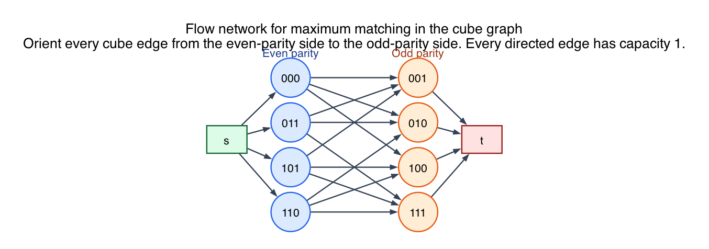
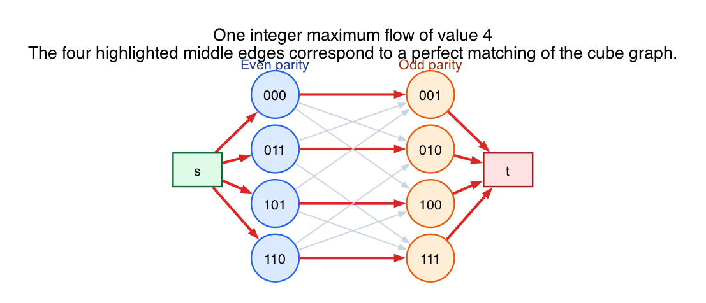

# PS9 Problem 1

Draw a flow network whose integer maximum flows represent the maximum matchings of the cube graph.

The constructed network is:

An example maximum flow, corresponding to a perfect matching of size `4`, is:

## Solution

Label the cube vertices by 3-bit binary strings:

- even parity side: `000, 011, 101, 110`
- odd parity side: `001, 010, 100, 111`

Two cube vertices are adjacent exactly when the labels differ in one bit, so every cube edge goes between the even-parity side and the odd-parity side. That makes the cube graph bipartite.

Now build a flow network as follows:

1. Add a source `s` and a sink `t`.
2. For each even-parity cube vertex `u`, add an edge `s -> u` of capacity `1`.
3. For each cube edge `u-v`, orient it from the even side to the odd side and give it capacity `1`.
4. For each odd-parity cube vertex `v`, add an edge `v -> t` of capacity `1`.

### Why does an integer flow give a matching?

If one unit of flow goes along

`s -> u -> v -> t`,

then we interpret that as choosing the cube edge `u-v` in the matching.

Because every edge incident to `s` and every edge into `t` has capacity `1`:

- no even-side vertex can be matched more than once
- no odd-side vertex can be matched more than once

So any integer flow picks a set of disjoint cube edges, which is exactly a matching.

### Why does any matching give an integer flow?

If the matching contains an edge `u-v`, send `1` unit of flow on

`s -> u -> v -> t`.

Since the matching edges are disjoint, capacity `1` is never violated.

Therefore matchings and integer flows correspond exactly.

### Maximum value

The cube has a perfect matching of size `4`, for example:

- `000-001`
- `011-010`
- `101-100`
- `110-111`

So the maximum flow value is `4`, and it represents a maximum matching.

## Fundamentals

- **Bipartite matching to flow reduction.** This is the standard reduction: source to left side, original edges across the middle, right side to sink.

- **Capacity 1 enforces matching.** Unit capacities prevent any vertex from being used by more than one chosen edge.

- **Integrality theorem.** Because all capacities are integers, a maximum flow can be chosen to be integral. That is what makes the correspondence with matchings exact.

- **Perfect matching.** A perfect matching uses every vertex exactly once. Since the cube has eight vertices, a perfect matching has size `4`.
