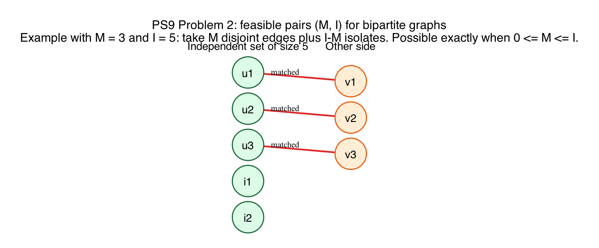

# PS9 Problem 2

Which pairs `(M, I)` can occur for a bipartite graph with maximum matching size `M` and maximum independent set size `I`?

The answer is:

`0 <= M <= I`.

The construction picture in this folder shows the example `M = 3`, `I = 5`.

## Solution

### Why these inequalities are necessary

For any bipartite graph with `n` vertices, lecture gives the identity

`M + I = n`.

Also, if the bipartition is `L union R`, then both `L` and `R` are independent sets. Therefore

`I >= max(|L|, |R|) >= n/2`.

Substitute `n = M + I` into `I >= n/2`:

`I >= (M + I)/2`.

Multiply by `2`:

`2I >= M + I`,

so

`I >= M`.

Also `M >= 0`, so the only possible pairs satisfy

`0 <= M <= I`.

### Why these inequalities are sufficient

Now assume `0 <= M <= I`.

Let

`k = I - M`.

Build a bipartite graph consisting of:

- `M` disjoint edges
- `k` isolated vertices

Then:

- the maximum matching size is exactly `M`, because all `M` disjoint edges can be used and no more matching edges exist
- the maximum independent set size is `M + k = I`, by taking one endpoint from each disjoint edge and all isolated vertices

So every pair with `0 <= M <= I` is achievable.

## Fundamentals

- **Matching number `M`.** This is the size of a largest set of pairwise disjoint edges.

- **Independent set size `I`.** This is the size of a largest set of vertices with no edges between them.

- **Why bipartite graphs help.** In a bipartite graph, each side of the bipartition is already an independent set.

- **The identity `M + I = n`.** For bipartite graphs, this is König's theorem in the form "maximum matching plus maximum independent set equals the number of vertices."
