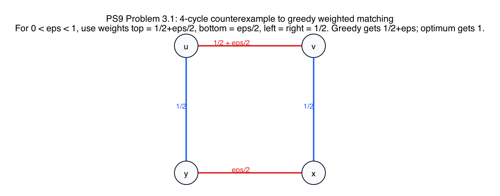
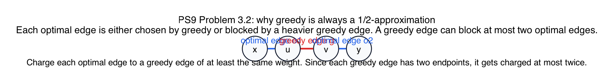

# PS9 Problem 3

This folder covers both parts of the problem:

- a 4-cycle counterexample showing greedy can do as badly as `1/2 + eps`
- the charging argument showing greedy is always at least a `1/2`-approximation

## Solution

### Part 3.1: counterexample

Use a 4-cycle with edge weights

- top edge: `1/2 + eps/2`
- bottom edge: `eps/2`
- left edge: `1/2`
- right edge: `1/2`

for any `0 < eps < 1`.

Then greedy picks the unique heaviest edge first, namely the top edge. After that, the only remaining edge it can still take is the opposite bottom edge. So greedy gets

`(1/2 + eps/2) + (eps/2) = 1/2 + eps`.

But the optimal matching takes the left and right edges, for total weight

`1/2 + 1/2 = 1`.

So the greedy ratio is `1/2 + eps`.

### Part 3.2: why greedy is always a `1/2`-approximation

Let `G` be the greedy matching and `O` be an optimal matching.

- Every optimal edge is either chosen by greedy, or it is blocked by an earlier greedy edge that shares one of its endpoints.
- Because greedy always chooses the heaviest currently available edge, the blocking greedy edge has weight at least the weight of the blocked optimal edge.
- A single greedy edge has only two endpoints, and `O` is a matching, so at most two optimal edges can touch that greedy edge.

Therefore, if we charge each optimal edge to a greedy edge that is at least as heavy, each greedy edge receives charge from at most two optimal edges. So

`w(O) <= 2 w(G)`,

which rearranges to

`w(G) >= (1/2) w(O)`.

## Fundamentals

- **Greedy weighted matching.** Repeatedly choose the heaviest remaining edge and delete all edges touching it.

- **Approximation ratio.** Saying greedy is a `1/2`-approximation means its weight is always at least half of the optimum.

- **Why the 4-cycle works as a counterexample.** The slightly heavier top edge tricks greedy into using up both of its endpoints, so the algorithm misses the two medium edges whose combined weight is better.

- **Charging proof.** Each optimal edge is assigned to a greedy edge that blocked it or selected it, and each greedy edge can receive charge from at most two optimal edges because it has only two endpoints.
